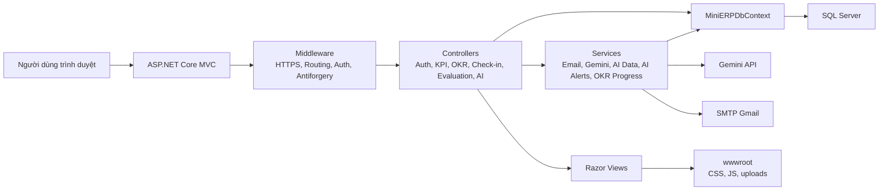
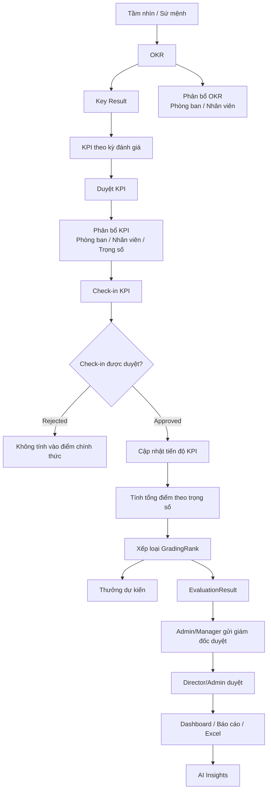
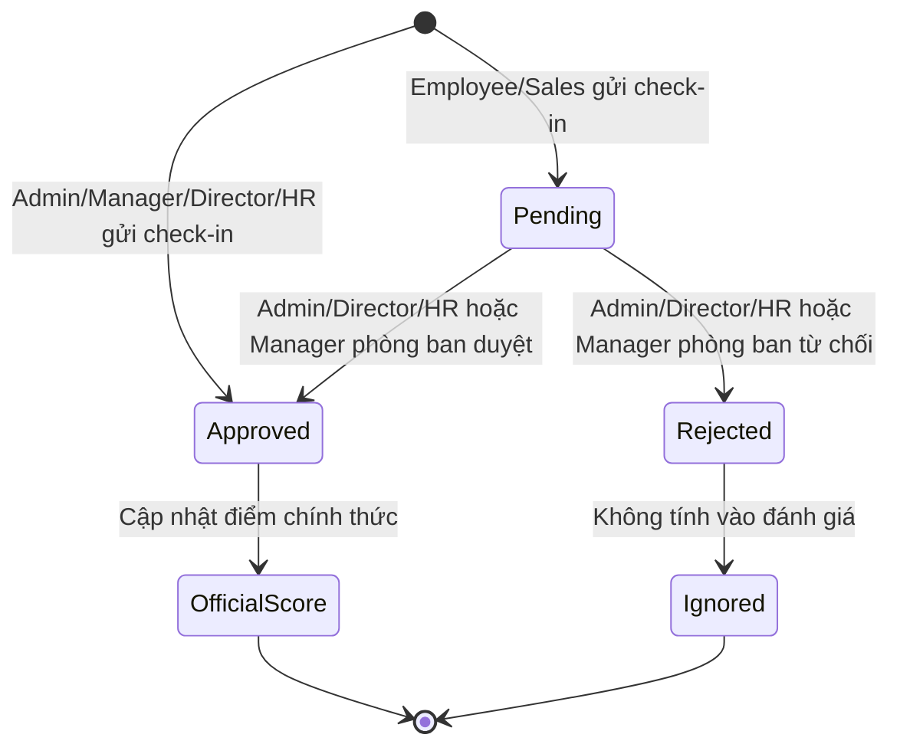
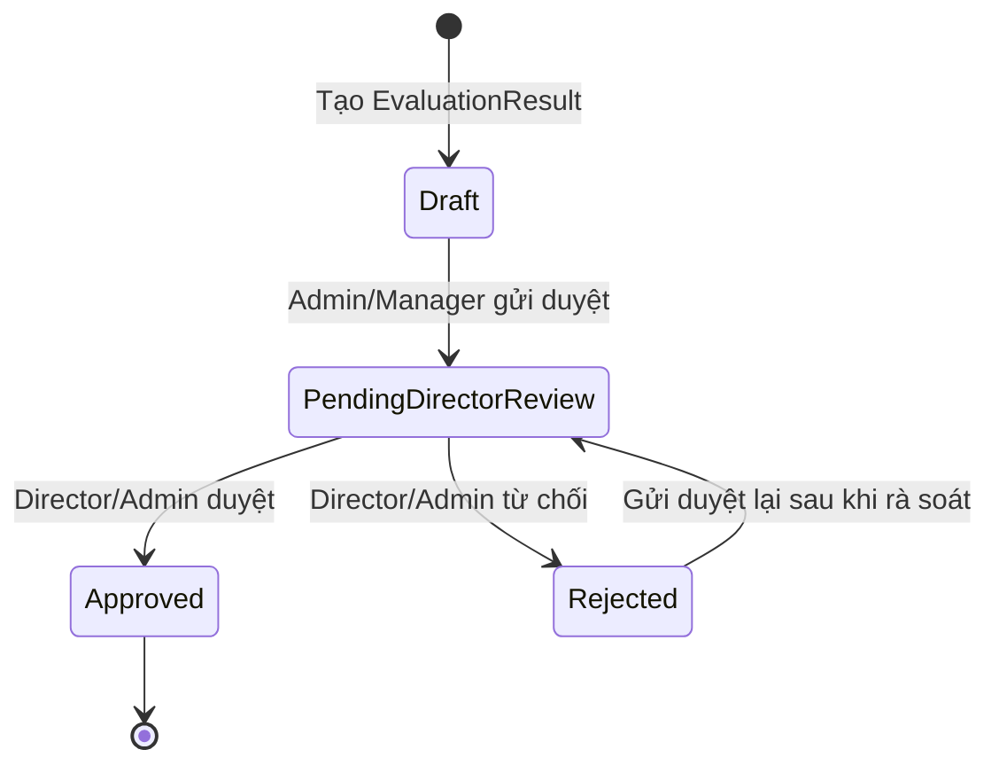

# VietMach KPI/OKR System

Hệ thống quản lý KPI/OKR cho doanh nghiệp, hỗ trợ thiết lập mục tiêu chiến lược, giao KPI, check-in tiến độ, duyệt kết quả, đánh giá nhân sự, quy đổi thưởng, báo cáo và phân tích bằng AI.

Dự án được xây dựng theo mô hình ASP.NET Core MVC, sử dụng Entity Framework Core với SQL Server, cookie authentication, phân quyền theo Role/Permission và tích hợp Gemini để hỗ trợ gợi ý, phân tích hiệu suất và cảnh báo thông minh.

## Mục lục

- [Tổng quan nghiệp vụ](#tổng-quan-nghiệp-vụ)
- [Tech stack](#tech-stack)
- [Kiến trúc tổng quan](#kiến-trúc-tổng-quan)
- [Cấu trúc thư mục](#cấu-trúc-thư-mục)
- [Luồng hệ thống chi tiết](#luồng-hệ-thống-chi-tiết)
- [Routes chính](#routes-chính)
- [Cài đặt và chạy local](#cài-đặt-và-chạy-local)
- [Cấu hình môi trường](#cấu-hình-môi-trường)
- [Database, migration và seed data](#database-migration-và-seed-data)
- [Dữ liệu và luồng test theo phân quyền](#dữ-liệu-và-luồng-test-theo-phân-quyền)
- [Luồng demo nhanh](#luồng-demo-nhanh)
- [Triển khai IIS](#triển-khai-iis)
- [Ghi chú bảo mật](#ghi-chú-bảo-mật)

## Tổng quan nghiệp vụ

VietMach KPI/OKR System gom các bước quản trị hiệu suất vào một luồng thống nhất:

1. Thiết lập nền tảng tổ chức: phòng ban, chức vụ, nhân viên, tài khoản, vai trò và quyền.
2. Khai báo tầm nhìn, sứ mệnh và mục tiêu chiến lược.
3. Tạo OKR, Key Result và phân bổ cho phòng ban hoặc nhân viên.
4. Tạo KPI theo kỳ đánh giá, liên kết KPI với OKR/Key Result khi cần.
5. Phân bổ KPI cho phòng ban hoặc nhân viên, kèm trọng số.
6. Nhân viên hoặc quản lý check-in tiến độ KPI.
7. Quản lý duyệt check-in, hệ thống cập nhật tiến độ, điểm đánh giá, xếp loại và thưởng dự kiến.
8. Admin/Manager/HR lập kết quả đánh giá; Admin/Manager gửi giám đốc duyệt.
9. Dashboard, báo cáo Excel và AI Insights hỗ trợ theo dõi toàn cảnh.

## Tech stack

| Thành phần | Công nghệ |
| --- | --- |
| Backend | ASP.NET Core MVC, .NET 10 |
| ORM | Entity Framework Core 10 |
| Database | SQL Server |
| Authentication | Cookie Authentication, Google OAuth |
| Authorization | Role/Permission, `HasPermissionAttribute` |
| UI | Razor Views, Bootstrap, jQuery, Select2, Chart.js, SweetAlert2 |
| Excel import/export | EPPlus |
| Environment config | DotNetEnv, ASP.NET Core configuration |
| AI | Gemini API qua `GeminiService` |
| Deployment | IIS, ASP.NET Core Module V2, in-process hosting |

## Kiến trúc tổng quan



Luồng request mặc định:

1. Người dùng truy cập ứng dụng.
2. Middleware xử lý HTTPS, routing, authentication và authorization.
3. Controller nhận request, kiểm tra quyền bằng `[Authorize]` và `[HasPermission]`.
4. Controller gọi `MiniERPDbContext` hoặc service nghiệp vụ.
5. View Razor render dữ liệu, dashboard, form hoặc báo cáo cho người dùng.

## Cấu trúc thư mục

| Thư mục/tệp | Vai trò |
| --- | --- |
| `Program.cs` | Cấu hình service, authentication, EF Core, migration tự động và route mặc định. |
| `Controllers/` | Xử lý request theo module: Auth, Dashboard, OKR, KPI, Check-in, Evaluation, HR, AI. |
| `Models/` | Entity chính và view model của hệ thống. |
| `Models/AI/` | DTO cho AI chat, gợi ý KPI, phân tích hiệu suất và smart alerts. |
| `Data/MiniERPDbContext.cs` | DbContext, DbSet, khóa chính, unique constraint và quan hệ giữa các bảng. |
| `Services/` | Dịch vụ email, AI/Gemini, cảnh báo thông minh và tính tiến độ OKR. |
| `Helpers/` | Tiện ích mã hóa, hash mật khẩu, phân trang, sinh mã, tính tiến độ. |
| `Filters/HasPermissionAttribute.cs` | Bộ lọc phân quyền theo permission code. |
| `Views/` | Razor Views cho từng module và layout chung. |
| `wwwroot/` | Static files: CSS, JS, Bootstrap, jQuery, upload avatar. |
| `Migrations/` | EF Core migrations và model snapshot. |
| `seeddata.sql` | Dữ liệu mẫu/khởi tạo: roles, permissions, danh mục, nhân sự, OKR/KPI mẫu. |
| `publish/web.config` | Cấu hình IIS cho bản publish. |

## Luồng hệ thống chi tiết

### Luồng nghiệp vụ end-to-end



### 1. Xác thực và tài khoản

Hệ thống hỗ trợ hai hình thức đăng nhập:

- Đăng nhập bằng username/password tại `/Auth/Login`.
- Đăng nhập Google OAuth tại `/Auth/GoogleLogin`.

Sau khi đăng nhập thành công, hệ thống tạo cookie authentication chứa các claim chính:

- `NameIdentifier`: ID tài khoản hệ thống.
- `Name`: username.
- `Role`: tên vai trò.
- `Email`: email khi đăng nhập Google.

Các luồng tài khoản khác:

- Đăng ký tài khoản tại `/Auth/Register`.
- Quên mật khẩu qua OTP email tại `/Auth/ForgotPassword`, `/Auth/VerifyOTP`, `/Auth/SetNewPassword`.
- Đổi mật khẩu khi đã đăng nhập tại `/Auth/ChangePassword`.
- Hồ sơ cá nhân tại `/Auth/MyProfile`.
- Cookie hết hạn sau 30 phút và có sliding expiration.
- Layout có cảnh báo không hoạt động sau 25 phút, sau đó đếm ngược 5 phút trước khi logout.

### 2. Phân quyền

Phân quyền được quản lý bằng `Role`, `Permission` và bảng liên kết `Role_Permission`.

Cơ chế kiểm tra quyền:

1. Controller/action gắn `[Authorize]` để yêu cầu đăng nhập.
2. Action nghiệp vụ gắn `[HasPermission("PERMISSION_CODE")]`.
3. `HasPermissionAttribute` kiểm tra role hiện tại trong claim.
4. Admin hoặc Administrator được toàn quyền.
5. HR hoặc Human Resources có đặc quyền xem nhân sự và kỳ đánh giá.
6. Nếu không đủ quyền, hệ thống trả về `Forbid` hoặc chuyển tới trang access denied.

Sidebar trong `Views/Shared/_Layout.cshtml` cũng đọc quyền từ database để chỉ hiển thị module người dùng được phép truy cập.

Ma trận thao tác theo vai trò chính:

| Luồng/module | Admin / Administrator | Director | Manager | HR / Human Resources | Employee / Sales |
| --- | --- | --- | --- | --- | --- |
| Hệ thống, role, user, audit | Toàn quyền role, user, permission, audit, catalog. | Xem audit/catalog theo quyền được cấp, không quản trị role/user mặc định. | Xem danh mục và dữ liệu nền tảng phục vụ phòng ban. | Quản lý user, nhân viên, phòng ban, chức vụ, kỳ đánh giá và danh mục HR. | Không quản trị hệ thống. |
| Mission/Vision, OKR | Toàn quyền. | Tạo, sửa, xóa, phân bổ OKR chiến lược. | Tạo/sửa OKR phòng ban, phân bổ cho nhân viên/phòng ban thuộc phạm vi quản lý. | Xem Mission/OKR để phục vụ nhân sự và báo cáo. | Xem OKR liên quan, cập nhật tiến độ KR khi có quyền cập nhật tiến độ. |
| KPI | Toàn quyền tạo, sửa, duyệt, từ chối, phân bổ, xóa. | Tạo, sửa, duyệt, từ chối, phân bổ KPI cấp cao. | Tạo, sửa, phân bổ, duyệt KPI trong phạm vi quản lý. | Chủ yếu xem KPI; không mặc định tạo/duyệt KPI nếu chưa được cấp thêm `KPIS_CREATE`. | Xem KPI được giao, không tạo/sửa/duyệt/phân bổ KPI. |
| Check-in KPI | Xem và duyệt tất cả; check-in do Admin gửi được tự động duyệt. | Xem và duyệt tất cả; check-in do Director gửi được tự động duyệt. | Tạo check-in, duyệt check-in của nhân viên thuộc phòng ban quản lý; không duyệt check-in của chính mình. | Xem và duyệt tất cả; check-in do HR gửi được tự động duyệt. | Tạo check-in cá nhân, trạng thái mặc định `Pending`; xem dữ liệu cá nhân. |
| Đánh giá nhân sự | Tạo/sửa/xóa, gửi duyệt và duyệt cuối. | Duyệt hoặc từ chối đánh giá ở trạng thái `PendingDirectorReview`. | Tạo/sửa đánh giá, gửi đánh giá nhân viên thuộc phòng ban mình quản lý lên Director. | Tạo/sửa đánh giá và quản lý dữ liệu HR; không gửi duyệt Director theo logic hiện tại nếu không có role Manager/Admin. | Xem kết quả đánh giá cá nhân theo quyền. |
| Dashboard, báo cáo | Xem toàn hệ thống, export báo cáo. | Xem toàn hệ thống, báo cáo chiến lược/phòng ban. | Xem dữ liệu phòng ban quản lý và xuất báo cáo theo quyền. | Xem dữ liệu nhân sự, kỳ đánh giá, báo cáo và thưởng. | Xem dashboard/KPI/OKR/check-in cá nhân. |
| AI | Dùng chat, phân tích, gợi ý KPI, review và AI Insights theo toàn quyền. | Dùng AI trên phạm vi toàn công ty; gợi ý KPI nếu có quyền tạo KPI. | Dùng AI trên phạm vi phòng ban quản lý; gợi ý KPI nếu có quyền tạo KPI. | Dùng AI cho dữ liệu HR/đánh giá theo quyền; sinh nhận xét khi được phép tạo/sửa đánh giá. | Dùng chat/phân tích trong phạm vi cá nhân; không dùng gợi ý KPI tạo mới. |

Ghi chú: `Sales` không nằm trong seed role mặc định nhưng được code xử lý như nhóm employee-like ở các luồng dữ liệu cá nhân.

### 3. Thiết lập nền tảng

Các module nền tảng được dùng để chuẩn bị dữ liệu trước khi vận hành KPI/OKR:

- `Catalog`: Admin quản lý toàn bộ; Director/HR có thể quản lý theo quyền danh mục; Manager chủ yếu xem danh mục.
- `Departments`: Admin/HR tạo và chỉnh sửa; Director/Manager xem; Manager được gắn làm người quản lý phòng ban.
- `Positions`: Admin/HR tạo và chỉnh sửa; Director/Manager xem.
- `Employees`: Admin/HR tạo, sửa, import/export và vô hiệu hóa; Manager/Director xem theo quyền; Employee/Sales không quản lý hồ sơ nhân sự.
- `SystemUsers`: Admin toàn quyền; HR có thể xem, tạo, sửa, khóa/mở hoặc reset mật khẩu nếu được cấp quyền tương ứng.
- `Roles`: Admin quản lý vai trò, đồng bộ permission và gán permission; các role khác không quản trị role mặc định.
- `AuditLogs`: Admin xem toàn bộ; Director có quyền xem nếu role được gán `AUDITLOGS_VIEW`.

### 4. Luồng chiến lược, OKR và Key Result

1. Admin và Director tạo/sửa/xóa Mission/Vision theo năm tại `/MissionVisions`; Manager/HR/Employee chủ yếu xem nếu có `MISSIONS_VIEW`.
2. Admin và Director tạo/sửa/xóa OKR tại `/OKRs`.
3. Manager tạo/sửa OKR cho phạm vi phòng ban nếu có `OKRS_CREATE` hoặc `OKRS_EDIT`; Employee/Sales bị chặn tạo/sửa/xóa OKR trong controller.
4. OKR có thể gắn với Mission/Vision, phòng ban hoặc nhân viên.
5. Admin/Director/Manager thêm, sửa, xóa Key Result; Employee/Sales chỉ cập nhật tiến độ KR khi có `EMPLOYEE_UPDATE_KPI_PROGRESS` và OKR nằm trong phạm vi được phép.
6. Khi cập nhật tiến độ Key Result, hệ thống dùng `ProgressHelper` để tính phần trăm hoàn thành và trạng thái kết quả.
7. OKR tính tiến độ tổng bằng trung bình tiến độ của các Key Result.

### 5. Luồng KPI

1. Admin, Director và Manager tạo KPI tại `/KPIs`; Employee/Sales bị chặn tạo KPI.
2. KPI có kỳ đánh giá, loại KPI, thuộc tính KPI, người giao, trạng thái và có thể liên kết OKR/Key Result.
3. Khi tạo mới, KPI mặc định ở trạng thái chờ duyệt.
4. Admin, Director và Manager duyệt hoặc từ chối KPI nếu có `KPIS_CREATE`; HR chỉ duyệt được khi được cấp thêm quyền tương ứng.
5. KPI đã bị từ chối không được check-in.
6. Admin, Director và Manager phân bổ KPI cho phòng ban hoặc nhân viên tại `/KPIs/AllocatePersonnel`; Employee/Sales không được phân bổ.
7. Với phân bổ nhân viên, hệ thống lưu trọng số để tính đóng góp vào điểm đánh giá.

### 6. Luồng check-in KPI



Chi tiết xử lý:

1. Employee/Sales chọn KPI được phân bổ và nhập giá trị thực đạt cho cá nhân.
2. Hệ thống kiểm tra KPI có thuộc về nhân viên/phòng ban của nhân viên không.
3. Hệ thống tính `ProgressPercentage` dựa trên target, trọng số và cấu hình `IsInverse`.
4. Nếu người gửi là Employee/Sales, check-in ở trạng thái `Pending`.
5. Nếu người gửi là Admin, Manager, Director hoặc HR, check-in tự động `Approved` vì đây là nhóm có quyền quản lý/xác nhận.
6. Check-in `Pending` xuất hiện ở hàng chờ duyệt `/KPICheckIns/ReviewQueue`.
7. Admin, Director và HR xem/duyệt toàn bộ check-in; Manager chỉ duyệt check-in của nhân viên thuộc phòng ban mình quản lý và không duyệt check-in của chính mình.
8. Khi duyệt `Approved`, hệ thống:
   - Ghi thông tin reviewer, thời gian duyệt, nhận xét và điểm review.
   - Cập nhật trạng thái KPI dựa trên tiến độ.
   - Tính tổng điểm nhân viên theo trọng số các KPI trong cùng kỳ.
   - Map điểm sang `GradingRank`.
   - Tạo hoặc cập nhật `EvaluationResult`.
   - Tính thưởng dự kiến bằng `BonusRule` và `RealtimeExpectedBonus`.
9. Khi duyệt `Rejected`, check-in không được tính vào điểm chính thức.

### 7. Luồng đánh giá nhân sự



Chi tiết xử lý:

1. `EvaluationResult` có thể được tạo tự động từ check-in KPI đã duyệt hoặc tạo thủ công bởi Admin/Manager/HR.
2. Trạng thái ban đầu là `Draft`.
3. Admin có thể gửi bất kỳ đánh giá nào lên Director review.
4. Manager bổ sung nhận xét và gửi đánh giá của nhân viên thuộc phòng ban mình quản lý lên Director review.
5. HR có thể tạo/sửa dữ liệu đánh giá theo quyền HR, nhưng logic gửi duyệt hiện tại chỉ cho Admin hoặc Manager.
6. Trạng thái chuyển thành `PendingDirectorReview`.
7. Director hoặc Admin duyệt thành `Approved` hoặc trả về `Rejected`.
8. Employee/Sales chỉ xem kết quả đánh giá cá nhân theo phạm vi quyền, không tạo/sửa/duyệt.
9. Các thao tác tạo, cập nhật, gửi duyệt, duyệt/từ chối được ghi audit log.

### 8. Dashboard và báo cáo

Dashboard mặc định nằm tại `/Dashboard/Index` và cũng là route mặc định của ứng dụng.

Dashboard hỗ trợ:

- Admin/Director xem dữ liệu toàn hệ thống.
- Manager xem dữ liệu phòng ban mình quản lý và dữ liệu cá nhân liên quan.
- HR xem dữ liệu nhân sự, kỳ đánh giá, báo cáo và thưởng theo quyền.
- Employee/Sales chỉ xem dashboard/KPI/OKR/check-in cá nhân.
- Mọi role có quyền dashboard có thể chọn kỳ đánh giá, xem thống kê KPI/OKR/check-in, biểu đồ trạng thái, xu hướng 6 tháng và top hiệu suất trong phạm vi dữ liệu được phép.

Báo cáo đánh giá tại `/EvaluationReports` hỗ trợ:

- Admin, Director, Manager và HR xem OKR/KR theo phòng ban và chu kỳ nếu có `EVALREPORTS_VIEW`.
- Director/Admin hoặc role có `EVALREPORTS_EDIT` lưu nhận xét tổng hợp của giám đốc.
- Role có `EVALREPORTS_VIEW` export Excel bằng EPPlus tại `/EvaluationReports/ExportExcel`.

### 9. AI và Smart Alerts

Module AI sử dụng `GeminiService`, `AIDataService` và `AIAlertService`.

Các chức năng chính:

- Tất cả người dùng đã đăng nhập có thể chat với bối cảnh dữ liệu KPI/OKR tại `/AI/Chat`; phạm vi dữ liệu phụ thuộc role.
- Admin, Director và Manager có `KPIS_CREATE` có thể dùng gợi ý KPI tại `/AI/SuggestKPI`; Employee/Sales bị chặn.
- Admin, Director và Manager có `KPIS_CREATE` có thể lấy danh sách lựa chọn gợi ý KPI tại `/AI/SuggestKpiOptions`; Employee/Sales bị chặn.
- Admin/Director phân tích hiệu suất toàn công ty; Manager phân tích trong phạm vi phòng ban quản lý; HR phân tích dữ liệu HR theo quyền; Employee/Sales phân tích dữ liệu cá nhân tại `/AI/AnalyzePerformance`.
- Admin, Manager, HR hoặc role có `EVALRESULTS_CREATE`/`EVALRESULTS_EDIT` có thể sinh nhận xét đánh giá tại `/AI/GenerateReview` trong phạm vi dữ liệu được phép.
- Người dùng đã đăng nhập xem/làm mới AI Insights tại `/AI/SmartAlerts` và `/AI/RefreshSmartAlerts`; alert được lưu cho nhân viên đang liên kết với tài khoản.

Cơ chế an toàn:

- AI chỉ xây dựng ngữ cảnh dựa trên phạm vi dữ liệu người dùng được phép xem.
- Nếu thiếu `GEMINI_API_KEY`, vượt rate limit hoặc Gemini lỗi, hệ thống trả cảnh báo và dùng nội dung rule-based fallback cho Smart Alerts.
- `GeminiService` có giới hạn nội bộ 15 request/phút và 1500 request/ngày.

## Routes chính

Route mặc định trong `Program.cs`:

```text
{controller=Dashboard}/{action=Index}/{id?}
```

Các route/module thường dùng:

| Route | Chức năng |
| --- | --- |
| `/Auth/Login` | Đăng nhập username/password. |
| `/Auth/GoogleLogin` | Đăng nhập Google OAuth. |
| `/Auth/ForgotPassword` | Quên mật khẩu, gửi OTP email. |
| `/Auth/ChangePassword` | Đổi mật khẩu. |
| `/Dashboard` | Trang tổng quan. |
| `/MissionVisions` | Tầm nhìn và sứ mệnh. |
| `/OKRs` | OKR và Key Result. |
| `/KPIs` | KPI, duyệt KPI, phân bổ KPI. |
| `/KPICheckIns` | Check-in KPI. |
| `/KPICheckIns/ReviewQueue` | Hàng chờ duyệt check-in. |
| `/KPICheckIns/EmployeeTracking` | Theo dõi KPI nhân viên. |
| `/EvaluationResults` | Kết quả đánh giá. |
| `/EvaluationResults/ReviewBoard` | Bảng duyệt đánh giá. |
| `/EvaluationReports` | Báo cáo đánh giá. |
| `/Employees` | Nhân viên. |
| `/Departments` | Phòng ban. |
| `/Positions` | Chức vụ. |
| `/Roles` | Vai trò và phân quyền. |
| `/SystemUsers` | Tài khoản hệ thống. |
| `/AuditLogs` | Lịch sử hệ thống. |
| `/AI` | Các API AI. |

## Cài đặt và chạy local

### Yêu cầu

- .NET SDK 10.x.
- SQL Server.
- Visual Studio 2026, Rider hoặc VS Code.
- Tùy chọn: tài khoản Google OAuth, SMTP Gmail app password, Gemini API key.

### Chạy ứng dụng

```powershell
dotnet restore
dotnet build
dotnet run --launch-profile https
```

URL local theo `Properties/launchSettings.json`:

- `https://localhost:7182`
- `http://localhost:5208`

Ứng dụng tự chạy EF Core migration khi khởi động:

```csharp
dbContext.Database.Migrate();
```

Vì vậy, sau khi cấu hình connection string hợp lệ, database sẽ được cập nhật schema theo migrations hiện có khi app start.

## Cấu hình môi trường

Dự án gọi `Env.Load()` trong `Program.cs`, vì vậy có thể đặt biến môi trường trong file `.env` ở root dự án hoặc cấu hình trực tiếp trên môi trường deploy.

Ví dụ `.env` an toàn:

```dotenv
GOOGLE_CLIENT_ID=your-google-client-id
GOOGLE_CLIENT_SECRET=your-google-client-secret
SmtpSettings__Password=your-smtp-app-password
GEMINI_API_KEY=your-gemini-api-key
ConnectionStrings__DefaultConnection=Server=localhost;Database=ManageKPIorOKRSystem;Trusted_Connection=True;TrustServerCertificate=True;MultipleActiveResultSets=True
```

Các key quan trọng:

| Key | Ý nghĩa |
| --- | --- |
| `ConnectionStrings__DefaultConnection` | Connection string SQL Server, nên cấu hình bằng environment variable để tránh lộ thông tin trong source. |
| `GOOGLE_CLIENT_ID` | Client ID cho Google OAuth. |
| `GOOGLE_CLIENT_SECRET` | Client secret cho Google OAuth. |
| `SmtpSettings__Password` | Mật khẩu ứng dụng SMTP Gmail. |
| `GEMINI_API_KEY` | API key dùng cho Gemini. |
| `Gemini__Model` | Tùy chọn model Gemini, mặc định trong code là `gemini-2.5-flash`. |

Lưu ý: ASP.NET Core dùng dấu `__` trong environment variable để biểu diễn dấu `:` trong cấu hình lồng nhau, ví dụ `SmtpSettings__Password` tương ứng `SmtpSettings:Password`.

## Database, migration và seed data

### Migration

EF Core migrations nằm trong thư mục `Migrations/`. Ứng dụng tự gọi migration khi khởi động, nên luồng local thông thường là:

1. Cấu hình `ConnectionStrings__DefaultConnection`.
2. Chạy ứng dụng.
3. App tự tạo/cập nhật schema database.

Nếu muốn chủ động cập nhật database bằng CLI:

```powershell
dotnet ef database update
```

### Seed data

File `seeddata.sql` chứa dữ liệu khởi tạo/mẫu:

- Roles và permissions.
- Role-permission mappings.
- Statuses, KPI types, OKR types, KPI properties.
- Check-in statuses, fail reasons, grading ranks.
- Bonus rules.
- Evaluation periods.
- System parameters.
- Mission/Vision, OKR, Key Result, KPI mẫu.
- Departments, positions, users, employees và assignments mẫu.

Khuyến nghị chỉ chạy `seeddata.sql` trên môi trường dev/test hoặc database mới. Trước khi chạy trên dữ liệu thật, cần đọc kỹ script và backup database.

## Dữ liệu và luồng test theo phân quyền

Dự án có thêm bộ dữ liệu test trực tiếp theo role:

- Script dữ liệu: [`testdata_role_flows.sql`](testdata_role_flows.sql)
- Hướng dẫn test: [`ROLE_TEST_FLOWS.md`](ROLE_TEST_FLOWS.md)

Script tạo/cập nhật các tài khoản `test_admin`, `test_director`, `test_manager`, `test_hr`, `test_employee`, `test_sales` với mật khẩu chung `Test@123`, kèm dữ liệu `TST_` cho phòng ban, nhân viên, kỳ đánh giá, OKR, KPI, check-in và kết quả đánh giá.

Chỉ chạy script này trên database dev/test:

```powershell
sqlcmd -S <server> -d <database> -U <user> -P <password> -i testdata_role_flows.sql
```

## Luồng demo nhanh

Để demo dự án theo kịch bản ngắn gọn, có sẵn tài liệu:

- Demo system flow: [`docs/DEMO_SYSTEM_FLOW.md`](docs/DEMO_SYSTEM_FLOW.md)
- Role test flow chi tiết: [`ROLE_TEST_FLOWS.md`](ROLE_TEST_FLOWS.md)

Luồng demo ngắn đề xuất:

1. Đăng nhập `test_director` để mở `/Dashboard` và `/OKRs`.
2. Chuyển sang `test_employee` để tạo check-in tại `/KPICheckIns/Create`.
3. Chuyển sang `test_manager` để duyệt ở `/KPICheckIns/ReviewQueue`.
4. Mở `/EvaluationResults` hoặc `/EvaluationReports` để chốt câu chuyện nghiệp vụ.

## Triển khai IIS

File `publish/web.config` cấu hình IIS chạy ứng dụng bằng ASP.NET Core Module V2:

- `processPath`: executable của ứng dụng publish.
- `hostingModel`: `inprocess`.
- `stdoutLogEnabled`: bật log stdout trong bản publish hiện tại.

Quy trình publish mẫu:

```powershell
dotnet publish -c Release -o publish
```

Checklist triển khai:

1. Cài .NET Hosting Bundle tương ứng trên server IIS.
2. Publish ứng dụng ra thư mục deploy.
3. Cấu hình Application Pool không dùng managed code.
4. Cấp quyền đọc/ghi cần thiết cho thư mục deploy, đặc biệt nếu dùng upload/avatar hoặc stdout logs.
5. Cấu hình environment variables trên IIS/server:
   - `ConnectionStrings__DefaultConnection`
   - `GOOGLE_CLIENT_ID`
   - `GOOGLE_CLIENT_SECRET`
   - `SmtpSettings__Password`
   - `GEMINI_API_KEY`
6. Kiểm tra database migration và quyền kết nối SQL Server.

## Ghi chú bảo mật

- Không commit `.env`, API key, SMTP password, Google secret hoặc connection string production.
- Nên đưa connection string ra environment variable hoặc secret store thay vì lưu trực tiếp trong `appsettings.json`.
- Không chia sẻ file publish/log nếu có chứa lỗi kèm thông tin môi trường.
- Seed data chỉ nên dùng cho môi trường thử nghiệm nếu có dữ liệu mẫu hoặc tài khoản mẫu.
- Tất cả form MVC đã được bật auto antiforgery validation qua `AutoValidateAntiforgeryTokenAttribute`.
- Quyền truy cập nghiệp vụ nên được kiểm tra ở cả UI và controller/action, không chỉ ẩn menu ở sidebar.
