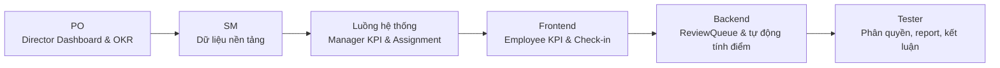
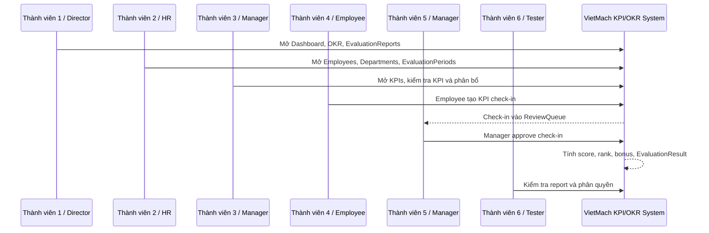

# Luồng Demo Dự Án Sau Thuyết Trình - Chia Đều 6 Thành Viên

> Mục tiêu tài liệu: giúp nhóm demo dự án sau phần thuyết trình một cách mượt, có phân vai đều, có tài khoản demo, có thứ tự bấm màn hình và có phương án dự phòng nếu một bước bị lỗi.

---

## 1. Mục Tiêu Demo

Sau khi thuyết trình xong, phần demo cần chứng minh 5 điểm:

- Hệ thống không chỉ nhập KPI, mà quản lý trọn vòng đời KPI/OKR.
- Dữ liệu được phân quyền theo vai trò: Director, Manager, HR, Employee/Sales, Admin.
- Nhân viên check-in KPI không tự động được tính điểm, mà phải qua bước duyệt.
- Khi check-in được duyệt, hệ thống tự cập nhật điểm, xếp loại, thưởng dự kiến và kết quả đánh giá.
- Dashboard, báo cáo và AI Insights hỗ trợ theo dõi tình hình sau khi dữ liệu được xử lý.

---

## 2. Chuẩn Bị Trước Khi Demo

### 2.1. Tài Khoản Demo

Tất cả tài khoản dùng chung mật khẩu:

```text
Test@123
```

| Username | Vai trò trong hệ thống | Dùng để demo |
| --- | --- | --- |
| `test_director` | Director | Dashboard toàn công ty, OKR chiến lược, duyệt đánh giá cuối |
| `test_manager` | Manager | KPI, phân bổ KPI, ReviewQueue, EvaluationResults |
| `test_employee` | Employee | Xem KPI cá nhân, tạo check-in |
| `test_hr` | HR | Nhân sự, kỳ đánh giá, bonus rule, báo cáo |
| `test_admin` | Admin | Phân quyền, tài khoản, catalog, audit log nếu cần |
| `test_sales` | Sales | Vai trò giống employee-like, dùng khi muốn demo thêm nhân viên thứ hai |

### 2.2. Dữ Liệu Demo Nổi Bật

| Dữ liệu | Giá trị nên dùng |
| --- | --- |
| Kỳ đánh giá | `TST-Q2-2026` |
| Công ty demo | `TST-COMP` |
| Phòng ban demo | `TST-SALES` |
| OKR công ty | `TST - Tăng trưởng doanh thu Q2-2026` |
| KPI cá nhân | `TST - Doanh số cá nhân Q2` |
| Check-in pending mẫu | `TST_PENDING_EMPLOYEE_FLOW` |
| Check-in approved mẫu | `TST_APPROVED_MANAGER_FLOW` |

### 2.3. Chuẩn Bị Màn Hình

Để tiết kiệm thời gian, nên mở sẵn 3 trình duyệt hoặc 3 profile khác nhau:

| Trình duyệt/profile | Đăng nhập sẵn |
| --- | --- |
| Browser 1 | `test_director` |
| Browser 2 | `test_manager` |
| Browser 3 | `test_employee` |

Nếu chỉ dùng một trình duyệt, cần tập thao tác logout/login trước để không mất thời gian.

### 2.4. Checklist Trước Demo

- Ứng dụng đã chạy được ở local hoặc server demo.
- Database đã có dữ liệu từ `seeddata.sql` và `testdata_role_flows.sql`.
- Đăng nhập thử được các tài khoản `test_director`, `test_manager`, `test_employee`.
- Đã mở sẵn các route quan trọng:
  - `/Dashboard`
  - `/OKRs`
  - `/KPIs`
  - `/KPICheckIns/Create`
  - `/KPICheckIns/ReviewQueue`
  - `/EvaluationResults`
  - `/EvaluationReports`
- Nếu có AI, kiểm tra `GEMINI_API_KEY`; nếu chưa có, vẫn demo bình thường và nói AI có fallback.

---

## 3. Phân Chia Demo Đều Cho 6 Thành Viên

Mặc định demo trong **12 phút**, mỗi thành viên **2 phút**.

| Thành viên | Vai trò thuyết trình | Tài khoản demo chính | Thời lượng | Nội dung demo |
| --- | --- | --- | ---: | --- |
| Thành viên 1 | PO | `test_director` | 2 phút | Mở bối cảnh demo, dashboard, OKR chiến lược |
| Thành viên 2 | SM | `test_hr` hoặc `test_admin` | 2 phút | Dữ liệu nền tảng, nhân sự, kỳ đánh giá, cách chuẩn bị vận hành |
| Thành viên 3 | Luồng hệ thống | `test_manager` | 2 phút | KPI, phân bổ KPI, liên kết OKR -> KPI |
| Thành viên 4 | Frontend | `test_employee` | 2 phút | Trải nghiệm employee, xem KPI, tạo check-in |
| Thành viên 5 | Backend | `test_manager` | 2 phút | ReviewQueue, duyệt check-in, cập nhật score/rank/evaluation |
| Thành viên 6 | Tester | `test_director` hoặc `test_employee` | 2 phút | Kiểm tra phân quyền, report, kết luận demo |

Nếu được demo **18 phút**, mỗi thành viên kéo dài thành **3 phút** bằng cách nói kỹ hơn phần ghi chú ở từng bước.

---

## 4. Sơ Đồ Luồng Demo Tổng Quát



---

## 5. Kịch Bản Demo Chi Tiết Theo Thành Viên

## Thành Viên 1 - PO: Mở Bối Cảnh, Dashboard Và OKR Chiến Lược

**Thời lượng:** 2 phút

**Tài khoản:** `test_director`

**Route cần mở:**

- `/Auth/Login`
- `/Dashboard`
- `/OKRs`
- `/EvaluationReports`

### Thao Tác Demo

1. Đăng nhập bằng `test_director`.
2. Mở `/Dashboard`.
3. Chọn hoặc nhắc đến kỳ đánh giá `TST-Q2-2026`.
4. Chỉ vào các chỉ số tổng quan KPI/OKR/check-in.
5. Mở `/OKRs`.
6. Tìm hoặc nhắc đến OKR `TST - Tăng trưởng doanh thu Q2-2026`.
7. Mở nhanh `/EvaluationReports` để cho thấy có báo cáo tổng hợp.

### Nội Dung Nói

> Em mở đầu phần demo bằng vai trò Director. Đây là góc nhìn cấp quản lý chiến lược. Director vào dashboard để xem tổng quan tình hình KPI/OKR theo kỳ đánh giá. Với dữ liệu demo, nhóm dùng kỳ `TST-Q2-2026`. Từ dashboard, Director có thể đi vào OKR để xem mục tiêu chiến lược như `TST - Tăng trưởng doanh thu Q2-2026`, sau đó xem báo cáo tổng hợp ở Evaluation Reports.

### Câu Chuyển Tiếp

> Sau khi có bức tranh chiến lược, hệ thống cần dữ liệu nền tảng như nhân sự, phòng ban và kỳ đánh giá để vận hành KPI/OKR. Phần này sẽ do thành viên tiếp theo demo.

---

## Thành Viên 2 - SM: Dữ Liệu Nền Tảng Và Cách Chuẩn Bị Vận Hành

**Thời lượng:** 2 phút

**Tài khoản:** `test_hr` hoặc `test_admin`

**Route cần mở:**

- `/Employees`
- `/Departments`
- `/Positions`
- `/EvaluationPeriods`
- `/BonusRules`

### Thao Tác Demo

1. Đăng nhập bằng `test_hr`.
2. Mở `/Employees` để cho thấy danh sách nhân viên demo.
3. Tìm hoặc nhắc đến các nhân viên:
   - `TST Director Strategy`
   - `TST Manager Sales`
   - `TST Employee Sales 01`
4. Mở `/Departments` để cho thấy phòng ban `TST-SALES`.
5. Mở `/EvaluationPeriods` và nhắc đến kỳ `TST-Q2-2026`.
6. Nếu còn thời gian, mở `/BonusRules` để nói về quy tắc thưởng theo rank.

### Nội Dung Nói

> Trước khi vận hành KPI/OKR, hệ thống cần dữ liệu nền tảng. Ở vai trò HR, em có thể quản lý nhân viên, phòng ban, chức vụ và kỳ đánh giá. Dữ liệu demo đang có phòng ban `TST-SALES`, các tài khoản Director, Manager, HR và Employee. Kỳ đánh giá chính là `TST-Q2-2026`. Đây là nền để các KPI được giao đúng người, đúng phòng ban và tính kết quả theo đúng kỳ.

### Câu Chuyển Tiếp

> Khi dữ liệu nền tảng đã sẵn sàng, Manager có thể bắt đầu tạo hoặc quản lý KPI, liên kết KPI với mục tiêu và phân bổ cho nhân viên.

---

## Thành Viên 3 - Luồng Hệ Thống: KPI, Phân Bổ Và Liên Kết OKR

**Thời lượng:** 2 phút

**Tài khoản:** `test_manager`

**Route cần mở:**

- `/KPIs`
- `/KPIs/AllocatePersonnel`
- `/OKRs`

### Thao Tác Demo

1. Đăng nhập bằng `test_manager`.
2. Mở `/KPIs`.
3. Tìm KPI `TST - Doanh số cá nhân Q2`.
4. Mở chi tiết KPI nếu có thể.
5. Chỉ ra các thông tin:
   - Kỳ đánh giá.
   - Trạng thái KPI.
   - Liên kết OKR/Key Result nếu có.
   - Người giao hoặc phòng ban liên quan.
6. Mở chức năng phân bổ KPI tại `/KPIs/AllocatePersonnel` nếu có nút tương ứng.
7. Nói rõ KPI được phân bổ cho nhân viên/phòng ban kèm trọng số.

### Nội Dung Nói

> Ở vai trò Manager, em demo tầng vận hành KPI. Sau khi doanh nghiệp có OKR, Manager tạo hoặc quản lý KPI theo kỳ đánh giá. KPI `TST - Doanh số cá nhân Q2` là KPI cá nhân trong kỳ `TST-Q2-2026`. KPI có thể liên kết với OKR hoặc Key Result để đảm bảo công việc hằng ngày đi theo mục tiêu chiến lược. Khi phân bổ KPI, hệ thống lưu người nhận và trọng số, đây là dữ liệu dùng để tính điểm đánh giá sau này.

### Câu Chuyển Tiếp

> Sau khi KPI được giao, người nhận KPI sẽ đăng nhập và check-in tiến độ thực hiện. Phần tiếp theo sẽ demo dưới góc nhìn Employee.

---

## Thành Viên 4 - Frontend: Trải Nghiệm Employee Và Tạo Check-in

**Thời lượng:** 2 phút

**Tài khoản:** `test_employee`

**Route cần mở:**

- `/Dashboard`
- `/KPIs`
- `/KPICheckIns/Create`

### Thao Tác Demo

1. Đăng nhập bằng `test_employee`.
2. Mở `/Dashboard` để cho thấy dashboard cá nhân.
3. Mở `/KPIs`.
4. Chỉ ra Employee chỉ thấy KPI được giao hoặc dữ liệu liên quan.
5. Mở `/KPICheckIns/Create`.
6. Chọn KPI `TST - Doanh số cá nhân Q2` nếu dropdown có dữ liệu.
7. Nhập giá trị đạt được và ghi chú demo, ví dụ:

```text
AchievedValue: 80
Note: Demo employee check-in sau thuyết trình
```

8. Submit check-in.
9. Nhấn mạnh trạng thái mới sẽ là `Pending`.

### Nội Dung Nói

> Bây giờ em demo góc nhìn Employee. Employee chỉ thấy dashboard và KPI liên quan đến mình. Khi vào danh sách KPI, nhân viên có thể xem KPI được giao, sau đó vào màn hình check-in để cập nhật kết quả thực tế. Điểm quan trọng là check-in của Employee không được tính điểm ngay, mà đi vào trạng thái Pending để Manager duyệt. Đây là cách hệ thống đảm bảo dữ liệu hiệu suất có kiểm soát.

### Câu Chuyển Tiếp

> Check-in vừa tạo sẽ đi vào hàng chờ duyệt. Tiếp theo, Manager sẽ xử lý check-in này và hệ thống sẽ tự động cập nhật kết quả.

---

## Thành Viên 5 - Backend: ReviewQueue, Duyệt Check-in Và Tự Động Tính Điểm

**Thời lượng:** 2 phút

**Tài khoản:** `test_manager`

**Route cần mở:**

- `/KPICheckIns/ReviewQueue`
- `/EvaluationResults`
- `/Dashboard`

### Thao Tác Demo

1. Quay lại tài khoản `test_manager`.
2. Mở `/KPICheckIns/ReviewQueue`.
3. Tìm check-in vừa tạo hoặc dùng check-in pending mẫu `TST_PENDING_EMPLOYEE_FLOW`.
4. Bấm duyệt `Approve`.
5. Nhập nhận xét nếu hệ thống yêu cầu, ví dụ:

```text
ReviewComment: Duyệt check-in demo, kết quả phù hợp.
ReviewScore: 80
```

6. Mở `/EvaluationResults`.
7. Chỉ ra kết quả đánh giá được tạo/cập nhật.
8. Nếu còn thời gian, mở lại `/Dashboard` để nói dữ liệu đã phản ánh vào tổng quan.

### Nội Dung Nói

> Ở bước này, em demo phần xử lý phía sau nghiệp vụ. Manager vào ReviewQueue để xem các check-in đang chờ duyệt. Khi Manager approve, hệ thống không chỉ đổi trạng thái check-in, mà còn cập nhật tiến độ KPI, tính tổng điểm theo trọng số, map sang Grading Rank, tính thưởng dự kiến và tạo hoặc cập nhật EvaluationResult. Đây là điểm quan trọng nhất của demo vì nó chứng minh hệ thống quản lý cả vòng đời, không chỉ lưu form.

### Câu Chuyển Tiếp

> Sau khi dữ liệu được xử lý, phần cuối sẽ kiểm tra phân quyền, báo cáo và chốt lại giá trị của hệ thống.

---

## Thành Viên 6 - Tester: Kiểm Tra Phân Quyền, Báo Cáo Và Chốt Demo

**Thời lượng:** 2 phút

**Tài khoản:** `test_director`, `test_employee` hoặc `test_hr`

**Route cần mở:**

- `/EvaluationReports`
- `/EvaluationResults/ReviewBoard`
- `/Roles` hoặc `/SystemUsers` để test phân quyền nếu dùng Employee
- `/AI/SmartAlerts` nếu có cấu hình AI hoặc muốn nói về fallback

### Thao Tác Demo

1. Mở `/EvaluationReports` bằng `test_director` hoặc `test_hr`.
2. Chọn kỳ `TST-Q2-2026` nếu có bộ lọc.
3. Chỉ ra dữ liệu báo cáo tổng hợp.
4. Mở `/EvaluationResults/ReviewBoard` bằng `test_director` nếu có dữ liệu chờ duyệt.
5. Nếu muốn demo phân quyền:
   - Đăng nhập `test_employee`.
   - Thử vào `/Roles` hoặc `/SystemUsers`.
   - Cho thấy hệ thống chặn hoặc chuyển về AccessDenied.
6. Nếu muốn demo AI:
   - Mở `/AI/SmartAlerts` hoặc widget AI.
   - Nếu AI chưa cấu hình, nói hệ thống vẫn chạy nghiệp vụ chính và có fallback.

### Nội Dung Nói

> Ở phần cuối, em demo dưới góc nhìn kiểm thử. Sau khi check-in được duyệt, dữ liệu phải xuất hiện ở EvaluationReports hoặc EvaluationResults. Ngoài ra, nhóm kiểm tra phân quyền bằng cách dùng Employee thử truy cập module quản trị như Roles hoặc SystemUsers. Nếu không có quyền, hệ thống sẽ chặn. Điều này chứng minh phần bảo mật role/permission hoạt động không chỉ ở giao diện mà còn ở backend. Kết luận lại, hệ thống đã demo đủ luồng từ mục tiêu, KPI, check-in, duyệt, tính điểm đến báo cáo.

### Câu Kết Demo

> Như vậy, phần demo đã cho thấy VietMach KPI/OKR System quản lý trọn vòng đời KPI/OKR: từ chiến lược, phân bổ, thực thi, duyệt, đánh giá đến báo cáo và AI Insights. Hệ thống giúp dữ liệu hiệu suất tập trung, minh bạch và có kiểm soát theo vai trò.

---

## 6. Sơ Đồ Sequence Luồng Demo Chính



---

## 7. Luồng Demo 18 Phút Nếu Có Thêm Thời Gian

Nếu thầy/cô cho demo dài hơn, giữ nguyên thứ tự nhưng mỗi thành viên nói **3 phút**:

| Thành viên | Thêm nội dung |
| --- | --- |
| PO | Nói thêm thực trạng Excel/manual và lý do cần dashboard |
| SM | Nói thêm Trello board, sprint backlog, Definition of Done |
| Luồng hệ thống | Demo thêm OKR liên kết Key Result hoặc giải thích workflow end-to-end |
| Frontend | Demo thêm trạng thái UI, alert, notification, sidebar theo quyền |
| Backend | Demo thêm EvaluationResults, ReviewBoard hoặc AI Smart Alerts |
| Tester | Demo thêm test phân quyền, export Excel, AI fallback |

---

## 8. Phương Án Dự Phòng Khi Demo Lỗi

| Vấn đề | Cách xử lý nhanh khi đang demo |
| --- | --- |
| Không tạo được check-in mới | Dùng check-in pending mẫu `TST_PENDING_EMPLOYEE_FLOW` trong ReviewQueue |
| Không thấy KPI trong tài khoản Employee | Nói dùng dữ liệu seed; chuyển sang Manager mở KPI `TST - Doanh số cá nhân Q2` |
| Login mất thời gian | Dùng 3 browser/profile đã đăng nhập sẵn |
| AI không chạy do thiếu API key | Nói AI là lớp hỗ trợ, nghiệp vụ chính vẫn chạy độc lập; demo dashboard/report thay thế |
| Export Excel lỗi hoặc tải chậm | Chỉ mở EvaluationReports và nói export dùng EPPlus |
| Không thấy dữ liệu mới trên dashboard | Mở EvaluationResults hoặc EvaluationReports để chứng minh dữ liệu đã cập nhật |
| Truy cập `/Roles` bằng Employee không hiện AccessDenied rõ | Nói hệ thống chặn theo backend bằng `[HasPermission]`; chuyển về sidebar để chỉ ra Employee không có module quản trị |

---

## 9. Checklist Tập Demo

- Mỗi người tập đúng phần của mình trong 2 phút.
- Không giải thích lại toàn bộ lý thuyết đã thuyết trình; chỉ nói những gì đang bấm.
- Người sau phải bắt đầu bằng câu nối từ người trước.
- Ưu tiên demo luồng chính: Director -> HR/Foundation -> Manager KPI -> Employee Check-in -> Manager Approve -> Report/Permission.
- Không tạo quá nhiều dữ liệu mới trong lúc demo.
- Nếu một bước lỗi, chuyển ngay sang dữ liệu mẫu đã chuẩn bị.
- Tổng thời gian demo nên nằm trong 11-13 phút.

---

## 10. Kịch Bản Nói Siêu Ngắn Để Nhớ

| Thành viên | Câu nhớ nhanh |
| --- | --- |
| PO | "Director nhìn bức tranh toàn công ty qua Dashboard và OKR." |
| SM | "Muốn chạy KPI/OKR phải có dữ liệu nền: nhân sự, phòng ban, kỳ đánh giá." |
| Luồng hệ thống | "Manager biến mục tiêu thành KPI và phân bổ cho người thực hiện." |
| Frontend | "Employee nhìn KPI của mình và gửi check-in ở trạng thái Pending." |
| Backend | "Manager approve thì hệ thống tự tính score, rank, bonus và evaluation." |
| Tester | "Cuối cùng kiểm tra report và chứng minh phân quyền hoạt động đúng." |

