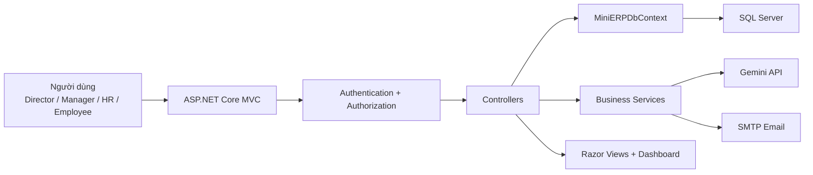
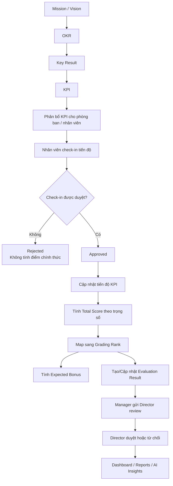
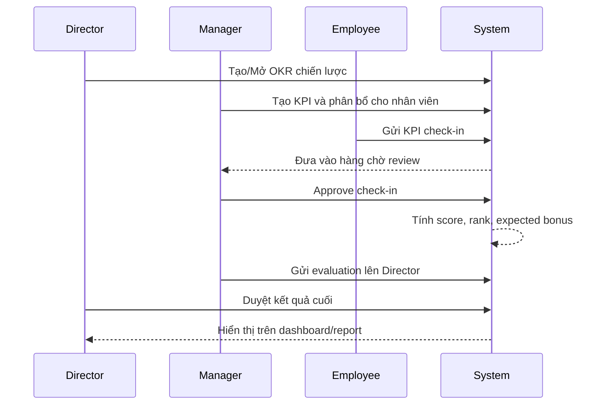

# Luồng Demo Hệ Thống KPI/OKR

Tài liệu này gom lại phần bạn cần nhất để demo dự án: kiến trúc tổng quan, luồng nghiệp vụ xuyên suốt và kịch bản bấm màn hình trong 5-7 phút.

## 1. Mục tiêu demo

Khi demo, nên làm rõ 4 ý:

1. Hệ thống quản lý KPI/OKR theo vòng đời hoàn chỉnh, không chỉ là nhập chỉ tiêu.
2. Dữ liệu được phân quyền theo vai trò: Director, Manager, HR, Employee, Sales.
3. Check-in KPI không dừng ở ghi nhận tiến độ mà còn đi tiếp sang đánh giá, xếp hạng và thưởng dự kiến.
4. AI là lớp hỗ trợ phân tích và gợi ý, không thay thế logic nghiệp vụ lõi.

## 2. Kiến trúc để mở đầu demo



Thông điệp trình bày:

- Người dùng vào hệ thống qua `AuthController`.
- Quyền truy cập được chặn bởi `[Authorize]` và `[HasPermission(...)]`.
- Nghiệp vụ chính nằm ở các controller như `OKRs`, `KPIs`, `KPICheckIns`, `EvaluationResults`, `Dashboard`, `AI`.
- Dữ liệu được lưu trong SQL Server qua `MiniERPDbContext`.

## 3. Luồng nghiệp vụ end-to-end



Điểm quan trọng để nói khi demo:

- `Employee/Sales` gửi check-in sẽ vào trạng thái `Pending`.
- `Manager/Director/HR/Admin` có quyền review check-in.
- Khi check-in được duyệt, hệ thống tự cập nhật `EvaluationResult`, `GradingRank` và `RealtimeExpectedBonus`.
- Đánh giá cuối có thêm một vòng `PendingDirectorReview` trước khi chốt.

## 4. Tài khoản và dữ liệu demo sẵn có

Nguồn dữ liệu demo đang có trong [`testdata_role_flows.sql`](../testdata_role_flows.sql) và mô tả chi tiết ở [`ROLE_TEST_FLOWS.md`](../ROLE_TEST_FLOWS.md).

Tài khoản dùng chung mật khẩu:

```text
Test@123
```

Các tài khoản nên dùng khi demo:

| Username | Vai trò | Mục đích demo |
| --- | --- | --- |
| `test_director` | Director | Mở đầu bằng bức tranh toàn công ty, duyệt đánh giá cuối. |
| `test_manager` | Manager | Tạo/phân bổ KPI, duyệt check-in, gửi đánh giá lên Director. |
| `test_employee` | Employee | Tạo check-in cá nhân và thể hiện luồng chờ duyệt. |
| `test_hr` | HR | Demo quản trị nhân sự, kỳ đánh giá, bonus rule nếu cần. |

Dữ liệu test nổi bật:

- Kỳ đánh giá: `TST-Q2-2026`
- Phòng ban: `TST-SALES`
- OKR: `TST - Tăng trưởng doanh thu Q2-2026`
- KPI cá nhân: `TST - Doanh số cá nhân Q2`
- Check-in pending mẫu: `TST_PENDING_EMPLOYEE_FLOW`

## 5. Kịch bản demo 5-7 phút

### Phần 1: Mở đầu bằng Director

Đăng nhập `test_director` tại `/Auth/Login`.

Đi qua các màn hình sau:

1. `/Dashboard`
2. Chọn kỳ `TST-Q2-2026`
3. `/OKRs`
4. `/EvaluationReports`

Thông điệp nên nói:

- Director nhìn được dữ liệu cấp công ty.
- Hệ thống đi từ mục tiêu chiến lược xuống OKR, rồi mới xuống KPI và đánh giá.
- Dashboard hiển thị số liệu tổng hợp thay vì chỉ danh sách thủ công.

### Phần 2: Chuyển sang Manager để thể hiện vận hành

Đăng nhập `test_manager`.

Đi theo thứ tự:

1. `/KPIs`
2. Mở KPI `TST - Doanh số cá nhân Q2`
3. `/KPICheckIns/ReviewQueue`
4. `/EvaluationResults`
5. `/EvaluationResults/ReviewBoard`

Thông điệp nên nói:

- Manager là vai trò vận hành chính của phòng ban.
- Manager giao KPI cho nhân viên, theo dõi hàng chờ check-in và xác nhận tiến độ.
- Sau khi duyệt check-in, hệ thống tự tính điểm, xếp loại và thưởng dự kiến.
- Manager có thể gửi kết quả đánh giá lên Director để review cuối.

### Phần 3: Chuyển sang Employee để thể hiện tương tác thực tế

Đăng nhập `test_employee`.

Đi theo thứ tự:

1. `/Dashboard`
2. `/KPIs`
3. Chọn KPI `TST - Doanh số cá nhân Q2`
4. `/KPICheckIns/Create`

Thông điệp nên nói:

- Employee chỉ thấy dữ liệu của mình hoặc KPI được giao.
- Khi nhân viên check-in, bản ghi đi vào `Pending`, không tự chốt điểm.
- Điều này giúp dữ liệu hiệu suất có kiểm soát và có bước xác nhận của quản lý.

### Phần 4: Quay lại Manager hoặc Director để chốt vòng đời

Nếu muốn kết thúc đẹp, quay lại `test_manager` hoặc `test_director`:

1. Manager vào `/KPICheckIns/ReviewQueue` để duyệt check-in mới.
2. Manager vào `/EvaluationResults` để gửi kết quả lên Director.
3. Director vào `/EvaluationResults/ReviewBoard` để `Approve`.
4. Mở lại `/Dashboard` hoặc `/EvaluationReports` để cho thấy dữ liệu đã phản ánh trên báo cáo.

## 6. Kịch bản demo rất nhanh 3 phút

Nếu thời gian ngắn, chỉ cần 3 vai:

1. `test_director` mở `/Dashboard` và `/OKRs` để nói về tầng chiến lược.
2. `test_employee` tạo check-in ở `/KPICheckIns/Create` để nói về tầng thực thi.
3. `test_manager` duyệt ở `/KPICheckIns/ReviewQueue` và mở `/EvaluationResults` để nói về tầng kiểm soát và đánh giá.

## 7. Luồng phân vai để thuyết trình



## 8. AI là phần cộng điểm trong demo

Nếu đã cấu hình `GEMINI_API_KEY`, bạn có thể thêm 1 phút cuối:

1. Mở widget AI hoặc gọi các màn hình liên quan đến AI.
2. Demo `AnalyzePerformance` hoặc `SmartAlerts`.
3. Nhấn mạnh AI chỉ dùng dữ liệu trong phạm vi quyền hiện tại.

Nếu chưa cấu hình AI, vẫn demo được toàn bộ nghiệp vụ chính vì luồng KPI/OKR/check-in/evaluation hoạt động độc lập.

## 9. Câu chốt khi kết thúc demo

Bạn có thể kết lại bằng một câu ngắn:

> Hệ thống này không chỉ giao KPI, mà quản lý trọn vòng đời từ mục tiêu chiến lược, phân bổ công việc, check-in tiến độ, phê duyệt, đánh giá đến báo cáo và hỗ trợ phân tích bằng AI.
