# Bài Thuyết Trình 20 Phút - VietMach KPI/OKR System

> File tổng hợp cuối cùng, dựa trên các tài liệu trước: `PRESENTATION_20_MIN_OUTLINE.md`, `PRESENTATION_FULL_MARKDOWN.md` và `DEMO_FLOW_6_MEMBERS.md`.
>
> Mục tiêu: dùng trực tiếp để tạo slide PowerPoint/Canva/Marp. Mỗi slide có **người nói**, **thời lượng**, **nội dung trên slide**, **sơ đồ Mermaid nếu cần**, và **lời thoại gợi ý**.

---

## Tổng Thời Lượng Và Phân Vai

| Vai trò | Slide phụ trách | Thời lượng |
| --- | --- | ---: |
| PO | Slide 1-4 | 3 phút |
| SM | Slide 5-7 | 3 phút |
| Luồng hệ thống | Slide 8-11 | 4 phút |
| Frontend | Slide 12-14 | 3 phút |
| Backend | Slide 15-16 | 4 phút |
| Tester | Slide 17-18 | 3 phút |
| **Tổng** | **18 slide** | **20 phút** |

---

## Slide 1 - Tên Đề Tài Và Thành Viên

**Người nói:** PO  
**Thời lượng:** 0.5 phút

### Nội dung trên slide

- **VietMach KPI/OKR System**
- Hệ thống quản lý KPI/OKR cho doanh nghiệp
- Thành viên theo vai trò:
  - PO
  - SM
  - Luồng hệ thống
  - Frontend
  - Backend
  - Tester
- Mục tiêu bài nói: trình bày bài toán, giải pháp, luồng nghiệp vụ, kiến trúc, giao diện và kiểm thử.

### Sơ đồ

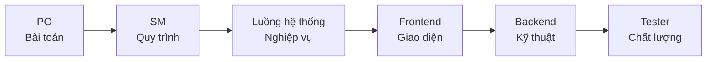

### Lời thoại gợi ý

> Xin chào thầy cô và các bạn. Nhóm em trình bày đề tài VietMach KPI/OKR System, một hệ thống web hỗ trợ doanh nghiệp quản lý KPI và OKR từ mục tiêu chiến lược đến đánh giá cuối kỳ. Bài thuyết trình được chia theo 6 vai trò: PO, SM, luồng hệ thống, frontend, backend và tester để thể hiện đầy đủ góc nhìn sản phẩm, quy trình, nghiệp vụ, kỹ thuật và chất lượng.

---

## Slide 2 - Bài Toán Và Nhu Cầu Khách Hàng

**Người nói:** PO  
**Thời lượng:** 1 phút

### Nội dung trên slide

- Khách hàng mục tiêu: doanh nghiệp có nhiều phòng ban, nhiều cấp quản lý.
- Nhu cầu chính:
  - Theo dõi mục tiêu chiến lược và KPI theo kỳ.
  - Nhân viên check-in tiến độ minh bạch.
  - Quản lý duyệt dữ liệu trước khi tính điểm.
  - HR/Director cần báo cáo, xếp loại và thưởng dự kiến.
  - Hệ thống cần phân quyền theo vai trò.
- Vấn đề hiện tại:
  - Quản lý thủ công bằng Excel/file rời.
  - Dữ liệu phân tán, khó truy vết.
  - Đánh giá cuối kỳ dễ thiếu minh bạch.

### Sơ đồ

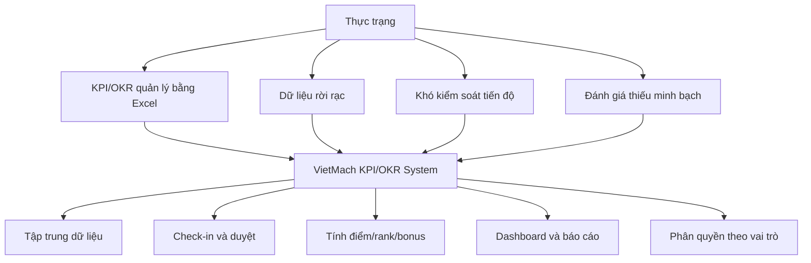

### Lời thoại gợi ý

> Khi phân tích nhu cầu khách hàng, nhóm nhận thấy nhiều doanh nghiệp vẫn quản lý KPI bằng Excel hoặc các file riêng lẻ. Điều này khiến mục tiêu chiến lược, KPI hằng ngày, check-in tiến độ và đánh giá cuối kỳ không nằm trong cùng một luồng. Hệ thống VietMach KPI/OKR System giải quyết bằng cách tập trung dữ liệu, cho phép check-in có kiểm duyệt, tự động tính điểm và cung cấp dashboard, báo cáo theo từng vai trò.

---

## Slide 3 - Môi Trường Áp Dụng, Quy Mô Và Tầm Nhìn

**Người nói:** PO  
**Thời lượng:** 1 phút

### Nội dung trên slide

- Môi trường áp dụng:
  - Web nội bộ doanh nghiệp.
  - Các vai trò: Admin, Director, Manager, HR, Employee/Sales.
  - Vận hành theo kỳ đánh giá tháng/quý/năm.
- Quy mô:
  - Nhiều module nghiệp vụ: nhân sự, OKR, KPI, check-in, evaluation, report, AI.
  - Nhiều cấp dữ liệu: công ty, phòng ban, cá nhân.
  - Có seed data, test data và tài khoản demo.
- Tầm nhìn:
  - Số hóa quản trị hiệu suất.
  - Kết nối chiến lược công ty với hành động của từng nhân viên.
  - Hỗ trợ ra quyết định bằng dữ liệu.

### Sơ đồ

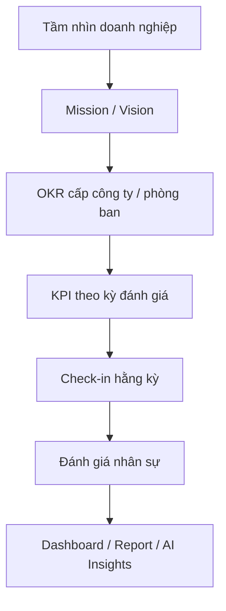

### Lời thoại gợi ý

> Hệ thống được thiết kế cho môi trường doanh nghiệp nội bộ, nơi nhiều vai trò cùng tham gia vào quy trình quản trị hiệu suất. Director quan tâm mục tiêu chiến lược, Manager quan tâm vận hành KPI phòng ban, HR quan tâm dữ liệu nhân sự và đánh giá, còn Employee cần xem KPI được giao và check-in tiến độ. Tầm nhìn của hệ thống là biến KPI/OKR thành một quy trình số hóa liên tục, từ chiến lược đến thực thi và báo cáo.

---

## Slide 4 - Chức Năng Chính, Phụ Và Phi Chức Năng

**Người nói:** PO  
**Thời lượng:** 0.5 phút

### Nội dung trên slide

- Chức năng chính:
  - Mission/Vision, OKR, Key Result.
  - KPI, duyệt KPI, phân bổ KPI.
  - KPI Check-in, ReviewQueue.
  - Evaluation Result, Grading Rank, Bonus Rule.
  - Dashboard, EvaluationReports, Export Excel, AI Insights.
- Chức năng phụ:
  - Department, Position, Employee.
  - SystemUser, Role, Permission, AuditLog.
  - Quên mật khẩu OTP, Google OAuth, Notification.
- Phi chức năng:
  - Bảo mật theo role/permission.
  - Dữ liệu tập trung, truy vết được.
  - Giao diện dễ dùng, hỗ trợ dashboard.
  - Có thể triển khai IIS.

### Sơ đồ

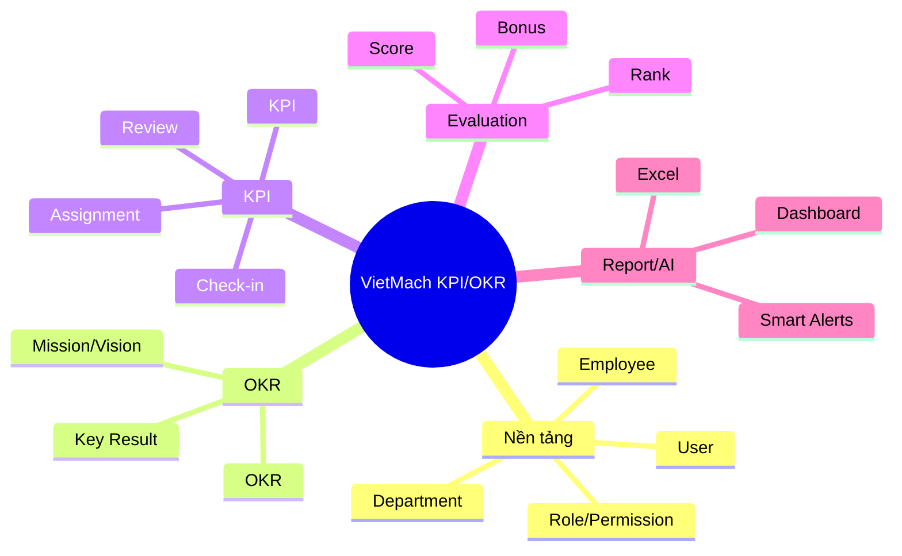

### Lời thoại gợi ý

> Phạm vi dự án gồm cả nghiệp vụ chính và các module nền tảng. Chức năng lõi là OKR, KPI, check-in, duyệt, đánh giá và báo cáo. Các chức năng phụ như nhân sự, phòng ban, tài khoản và phân quyền giúp hệ thống vận hành đúng thực tế doanh nghiệp. Ngoài ra, hệ thống cũng chú trọng các yêu cầu phi chức năng như bảo mật, truy vết dữ liệu và khả năng triển khai.

---

## Slide 5 - Quy Trình Làm Việc Scrum

**Người nói:** SM  
**Thời lượng:** 1 phút

### Nội dung trên slide

- Nhóm áp dụng Scrum để chia nhỏ công việc.
- Vai trò trong nhóm:
  - PO: xác định yêu cầu và ưu tiên backlog.
  - SM: theo dõi sprint, tháo gỡ vướng mắc.
  - Frontend/Backend: phát triển tính năng.
  - Tester: kiểm tra nghiệp vụ và phân quyền.
- Vòng lặp:
  - Planning.
  - Development.
  - Review.
  - Testing.
  - Retrospective.

### Sơ đồ

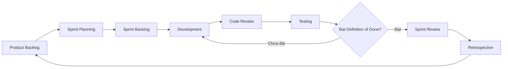

### Lời thoại gợi ý

> Vì dự án có nhiều module liên quan với nhau, nhóm áp dụng Scrum để chia nhỏ công việc theo sprint. Product backlog chứa toàn bộ yêu cầu, sau đó nhóm chọn các yêu cầu ưu tiên vào sprint backlog. Trong mỗi sprint, frontend, backend và tester phối hợp để hoàn thành tính năng. Sau khi phát triển, tính năng được review, test và chỉ hoàn thành khi đạt Definition of Done.

---

## Slide 6 - Backlog, Trello, Git Và Sprint Backlog

**Người nói:** SM  
**Thời lượng:** 1 phút

### Nội dung trên slide

- Product backlog:
  - Auth, HR, OKR, KPI, Check-in, Evaluation, Report, AI.
- Sprint backlog:
  - Chia user story thành task frontend, backend, tester.
- Trello:
  - Backlog -> To Do -> In Progress -> Review -> Testing -> Done.
- Git:
  - Commit theo tính năng.
  - Theo dõi lịch sử sửa lỗi.
  - Tránh mất thay đổi khi nhiều người cùng làm.

### Sơ đồ

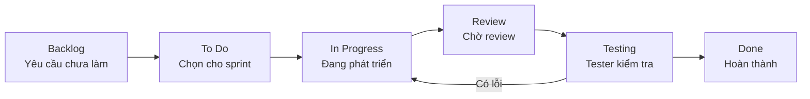

### Lời thoại gợi ý

> Backlog được chia theo module nghiệp vụ. Ví dụ, với Employee có story xem KPI và tạo check-in; với Manager có story duyệt check-in; với Director có story duyệt đánh giá cuối. Trello giúp nhóm theo dõi trạng thái từng task, còn Git giúp quản lý mã nguồn và lịch sử thay đổi. Cách làm này giúp nhóm kiểm soát tiến độ và giảm rủi ro khi nhiều người cùng phát triển.

---

## Slide 7 - Giám Sát Tiến Độ Và Definition Of Done

**Người nói:** SM  
**Thời lượng:** 1 phút

### Nội dung trên slide

- Giám sát tiến độ:
  - Cập nhật task hằng ngày.
  - Kiểm tra Trello và commit Git.
  - Demo nhanh sau mỗi module.
- Definition of Done:
  - Chạy được trên local.
  - Đúng nghiệp vụ.
  - Đúng phân quyền.
  - Có validation.
  - UI không vỡ layout.
  - Test case chính pass.
  - Không làm hỏng luồng cũ.

### Sơ đồ

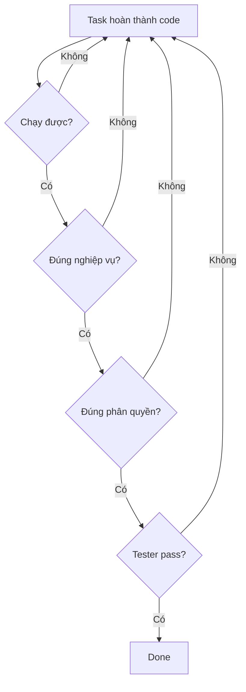

### Lời thoại gợi ý

> Với hệ thống KPI/OKR, hoàn thành không chỉ là code xong. Một task phải chạy được, đúng nghiệp vụ, đúng phân quyền và được tester kiểm tra. Đặc biệt, phân quyền là tiêu chí quan trọng vì hệ thống có nhiều vai trò. Nếu Employee nhìn thấy dữ liệu quản trị hoặc Manager tự duyệt check-in của chính mình thì đó là lỗi nghiệp vụ nghiêm trọng.

---

## Slide 8 - Use Case Và Tác Nhân Hệ Thống

**Người nói:** Luồng hệ thống  
**Thời lượng:** 1 phút

### Nội dung trên slide

- Tác nhân:
  - Admin.
  - Director.
  - Manager.
  - HR.
  - Employee/Sales.
- Use case chính:
  - Đăng nhập, đổi mật khẩu.
  - Quản lý nhân sự, phòng ban, tài khoản.
  - Quản lý OKR, KPI.
  - Check-in KPI.
  - Duyệt check-in và evaluation.
  - Xem dashboard, report, export Excel.
  - AI Chat, Suggest KPI, Smart Alerts.

### Sơ đồ

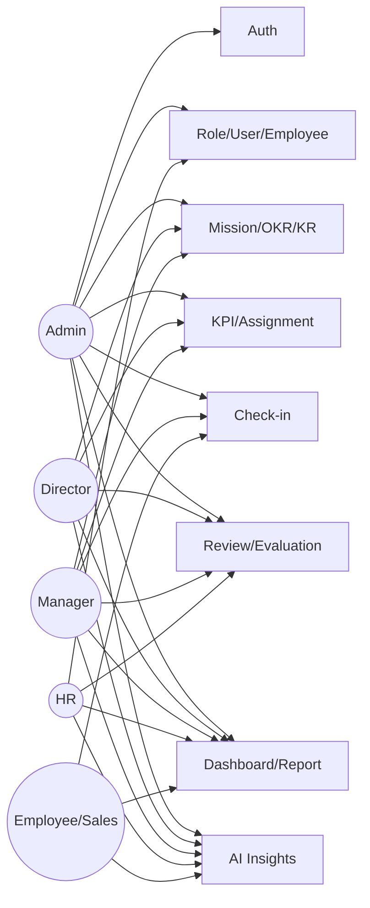

### Lời thoại gợi ý

> Hệ thống có nhiều tác nhân với phạm vi khác nhau. Admin quản trị toàn bộ, Director theo dõi mục tiêu chiến lược và duyệt kết quả cuối, Manager vận hành KPI phòng ban, HR quản lý nhân sự và báo cáo, còn Employee/Sales chủ yếu xem KPI được giao và check-in tiến độ. Điểm quan trọng là cùng một module nhưng mỗi vai trò có quyền và phạm vi dữ liệu khác nhau.

---

## Slide 9 - Workflow Nghiệp Vụ End-To-End

**Người nói:** Luồng hệ thống  
**Thời lượng:** 1.5 phút

### Nội dung trên slide

- Luồng chính:
  - Mission/Vision -> OKR -> Key Result.
  - Key Result -> KPI theo kỳ.
  - KPI được duyệt -> phân bổ cho phòng ban/nhân viên.
  - Employee check-in -> Manager/Director/HR/Admin review.
  - Approved -> tính score, rank, bonus, EvaluationResult.
  - Director review -> Dashboard/Report/AI.
- Nếu Rejected:
  - Không tính điểm chính thức.
  - Có thể rà soát và gửi lại.

### Sơ đồ

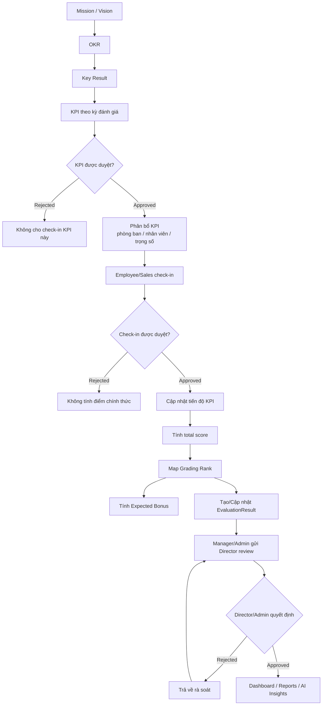

### Lời thoại gợi ý

> Đây là luồng quan trọng nhất của hệ thống. Doanh nghiệp bắt đầu bằng Mission/Vision, sau đó tạo OKR và Key Result. Từ đó, KPI được tạo theo kỳ đánh giá và phải được duyệt trước khi phân bổ. Khi Employee check-in, dữ liệu đi vào trạng thái chờ duyệt. Nếu được approve, hệ thống mới cập nhật tiến độ, tính điểm, xếp loại, thưởng dự kiến và tạo EvaluationResult. Cuối cùng, Manager gửi lên Director để chốt đánh giá và dữ liệu xuất hiện trên dashboard, report và AI Insights.

---

## Slide 10 - UI Flow Theo Vai Trò

**Người nói:** Luồng hệ thống  
**Thời lượng:** 1 phút

### Nội dung trên slide

- Director:
  - Login -> Dashboard -> OKRs -> EvaluationReports -> ReviewBoard.
- Manager:
  - Login -> KPIs -> AllocatePersonnel -> ReviewQueue -> EvaluationResults.
- Employee/Sales:
  - Login -> Dashboard cá nhân -> KPIs -> KPICheckIns/Create.
- HR:
  - Login -> Employees -> EvaluationPeriods -> BonusRules -> Reports.
- Admin:
  - Login -> Roles -> SystemUsers -> Catalog -> AuditLogs.

### Sơ đồ

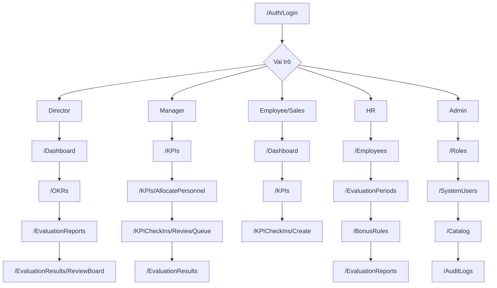

### Lời thoại gợi ý

> UI flow được thiết kế theo vai trò. Director đi từ dashboard đến OKR và báo cáo. Manager tập trung vào KPI, phân bổ và hàng chờ duyệt check-in. Employee chỉ cần xem KPI được giao và check-in. HR quản lý dữ liệu nhân sự, kỳ đánh giá và báo cáo. Admin quản lý tài khoản, phân quyền và audit. Cách điều hướng này giúp giảm thao tác thừa và tránh người dùng truy cập nhầm chức năng.

---

## Slide 11 - Phân Rã Chức Năng Và Cấu Trúc Phân Tầng

**Người nói:** Luồng hệ thống  
**Thời lượng:** 0.5 phút

### Nội dung trên slide

- Nhóm chức năng:
  - Foundation: Auth, Role, Permission, User.
  - Organization: Department, Position, Employee.
  - OKR: Mission/Vision, OKR, Key Result.
  - KPI: KPI, Detail, Assignment, Approval.
  - Execution: Check-in, ReviewQueue.
  - Evaluation: Score, Rank, Bonus, Director Review.
  - Report/AI: Dashboard, Excel, AI Insights.
- Phân tầng:
  - Presentation -> Controller -> Service/Helper -> EF Core -> SQL Server.

### Sơ đồ

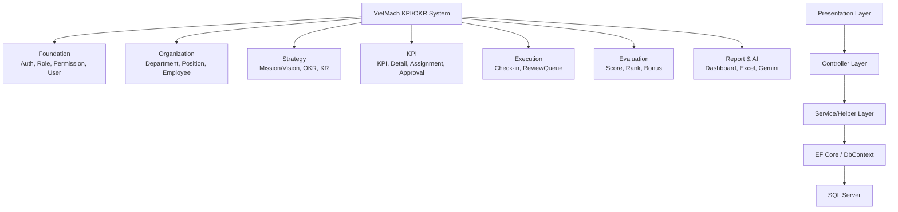

### Lời thoại gợi ý

> Nếu nhìn theo chức năng, hệ thống được chia thành các nhóm từ nền tảng, tổ chức, OKR, KPI, check-in, evaluation đến report và AI. Nếu nhìn theo kỹ thuật, hệ thống đi theo cấu trúc phân tầng: giao diện Razor Views, controller xử lý request, service/helper xử lý nghiệp vụ, EF Core truy cập dữ liệu và SQL Server lưu trữ.

---

## Slide 12 - Phong Cách Thiết Kế Frontend

**Người nói:** Frontend  
**Thời lượng:** 1 phút

### Nội dung trên slide

- Phong cách:
  - Enterprise dashboard.
  - Chuyên nghiệp, rõ ràng, ưu tiên dữ liệu.
- Màu sắc:
  - Xanh dương doanh nghiệp.
  - Nền sáng.
  - Sidebar xanh đậm.
- Thành phần:
  - Sidebar theo permission.
  - Header, notification.
  - Dashboard cards.
  - Data tables.
  - Forms, modals, alerts.
  - Charts và AI widget.
- Thư viện:
  - Razor Views, Bootstrap, jQuery, Select2, Chart.js, SweetAlert2.

### Sơ đồ

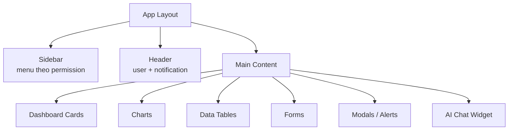

### Lời thoại gợi ý

> Frontend được thiết kế theo phong cách enterprise dashboard vì hệ thống phục vụ quản lý nội bộ và có nhiều dữ liệu. Màu xanh dương tạo cảm giác chuyên nghiệp, sidebar giúp điều hướng nhanh giữa các module, còn dashboard cards và biểu đồ giúp người dùng nắm tình hình nhanh. Các menu cũng hiển thị theo permission để mỗi vai trò chỉ thấy chức năng phù hợp.

---

## Slide 13 - Giao Diện Hệ Thống Chính

**Người nói:** Frontend  
**Thời lượng:** 1.25 phút

### Nội dung trên slide

- Dashboard:
  - Tổng quan KPI/OKR/check-in theo kỳ.
  - Biểu đồ trạng thái, xu hướng, top hiệu suất.
- OKR:
  - Danh sách OKR, Key Result, tiến độ.
  - Gắn Mission/Vision, phòng ban hoặc nhân viên.
- KPI:
  - Tạo, duyệt/từ chối, phân bổ KPI.
  - Liên kết OKR/Key Result.
- Check-in:
  - Employee nhập giá trị thực đạt.
  - ReviewQueue cho người có quyền duyệt.
- EvaluationReports:
  - Kết quả, rank, bonus.
  - Export Excel.

### Sơ đồ

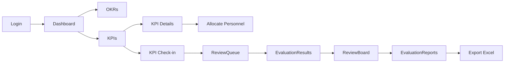

### Lời thoại gợi ý

> Các màn hình chính được thiết kế theo luồng nghiệp vụ. Dashboard là nơi xem tổng quan. OKR thể hiện mục tiêu chiến lược. KPI là nơi tạo, duyệt và phân bổ chỉ tiêu. Check-in là nơi nhân viên cập nhật tiến độ, còn ReviewQueue là nơi quản lý xác nhận dữ liệu. Cuối cùng, EvaluationReports giúp tổng hợp kết quả và xuất Excel phục vụ báo cáo.

---

## Slide 14 - UX, Trạng Thái Và Kiểm Soát Lỗi

**Người nói:** Frontend  
**Thời lượng:** 0.75 phút

### Nội dung trên slide

- UX theo trạng thái:
  - `Pending`: chờ duyệt.
  - `Approved`: đã xác nhận.
  - `Rejected`: bị từ chối.
  - `Draft`: bản nháp đánh giá.
  - `PendingDirectorReview`: chờ Director duyệt.
- Kiểm soát lỗi:
  - Validation form.
  - Alert khi thao tác thành công/thất bại.
  - AccessDenied khi thiếu quyền.
  - Notification nhắc người dùng.
- Mục tiêu:
  - Người dùng biết mình đang ở bước nào.
  - Giảm thao tác nhầm.
  - Giảm nhập sai dữ liệu.

### Sơ đồ

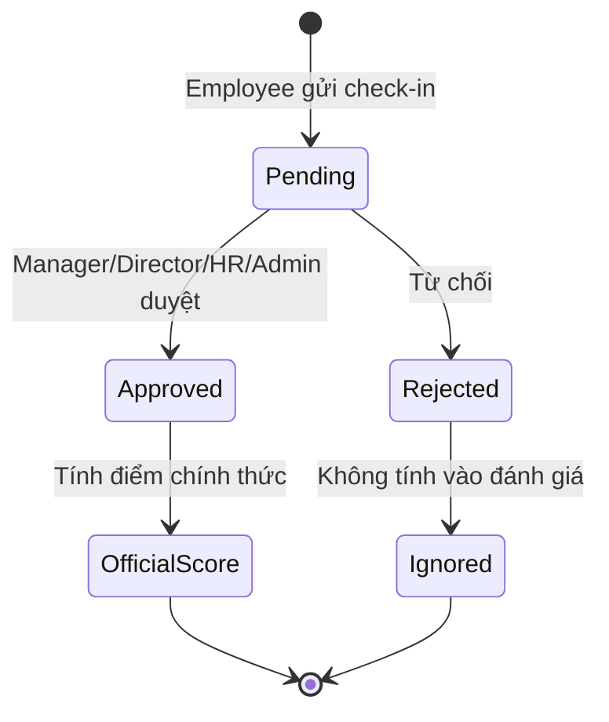

### Lời thoại gợi ý

> Do hệ thống có nhiều trạng thái nghiệp vụ, frontend cần hiển thị rõ để người dùng không bị nhầm. Ví dụ, check-in của Employee sẽ là Pending cho đến khi được duyệt. Evaluation có Draft và PendingDirectorReview để biết đánh giá đang ở bước nào. Ngoài ra, các form có validation, các thao tác có alert và người dùng thiếu quyền sẽ bị chuyển sang AccessDenied.

---

## Slide 15 - Kiến Trúc Kỹ Thuật Backend

**Người nói:** Backend  
**Thời lượng:** 2 phút

### Nội dung trên slide

- Công nghệ:
  - ASP.NET Core MVC, .NET 10.
  - Entity Framework Core 10.
  - SQL Server.
  - Cookie Authentication, Google OAuth.
  - EPPlus export Excel.
  - Gemini API.
- Luồng request:
  - Browser -> Middleware -> Controller -> Service/Helper -> MiniERPDbContext -> SQL Server.
- Service chính:
  - GeminiService.
  - AIDataService.
  - AIAlertService.
  - EmailService.
  - NotificationService.
  - OKRProgressService.
- Bảo mật:
  - Cookie HttpOnly.
  - Antiforgery token.
  - Data Protection keys.
  - Environment config.

### Sơ đồ

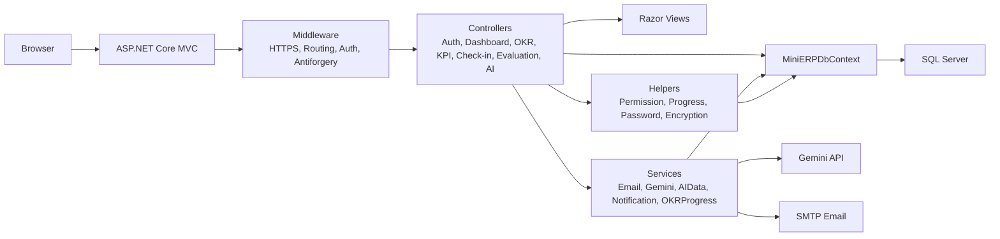

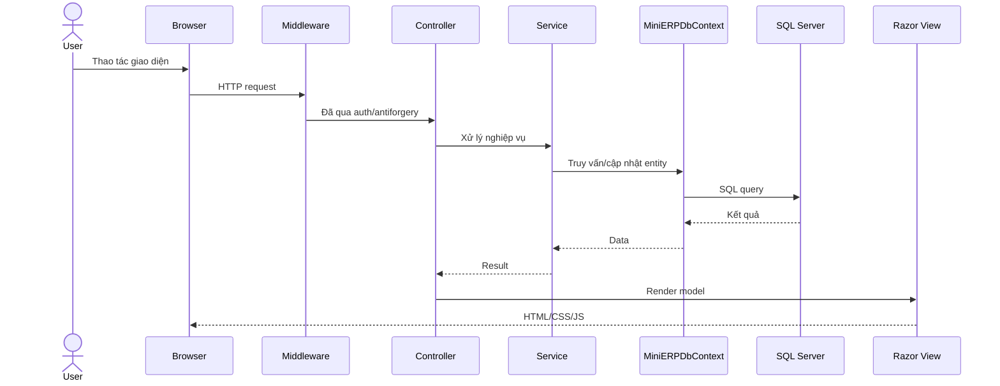

### Lời thoại gợi ý

> Backend dùng ASP.NET Core MVC trên .NET 10, Entity Framework Core và SQL Server. Request từ trình duyệt đi qua middleware như routing, authentication, authorization và antiforgery, sau đó vào controller. Controller gọi service hoặc helper để xử lý nghiệp vụ, rồi dùng MiniERPDbContext truy cập SQL Server. Các service như GeminiService, AIDataService, NotificationService và OKRProgressService giúp tách riêng những phần nghiệp vụ phức tạp.

---

## Slide 16 - ERD, Phân Quyền Và AI

**Người nói:** Backend  
**Thời lượng:** 2 phút

### Nội dung trên slide

- Nhóm bảng chính:
  - Foundation: Role, Permission, SystemUser, Employee, Department.
  - OKR: MissionVision, OKR, OKRKeyResult, allocations.
  - KPI: EvaluationPeriod, KPI, KPIDetail, assignments.
  - Check-in: KPICheckIn, CheckInDetail, CheckInStatus, HistoryLog.
  - Evaluation: EvaluationResult, GradingRank, BonusRule, RealtimeExpectedBonus.
  - System/AI: AuditLog, SystemAlert, AIGenerationHistory.
- Phân quyền:
  - `[Authorize]` yêu cầu đăng nhập.
  - `[HasPermission("PERMISSION_CODE")]` kiểm tra quyền.
  - Role_Permission lưu mapping quyền.
- AI:
  - Gemini API.
  - AI chỉ dùng dữ liệu trong phạm vi quyền.
  - Có fallback khi thiếu API key hoặc lỗi Gemini.

### Sơ đồ ERD rút gọn

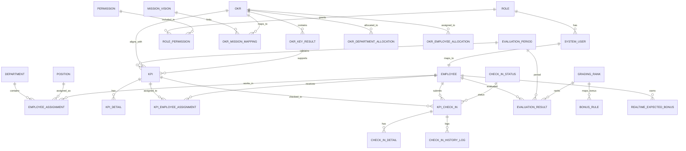

### Sơ đồ phân quyền và AI

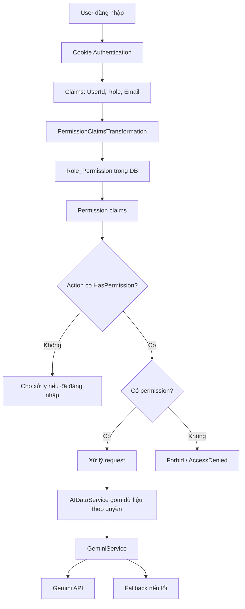

### Lời thoại gợi ý

> Database được chia thành các nhóm bảng theo nghiệp vụ: foundation, OKR, KPI, check-in, evaluation và system/AI. Các bảng liên kết như Role_Permission, KPI_Employee_Assignment hoặc OKR allocation giúp hệ thống quản lý quan hệ nhiều-nhiều. Về phân quyền, backend kiểm tra bằng Authorize và HasPermission nên người dùng không thể chỉ gọi URL trực tiếp để vượt quyền. AI được tích hợp qua Gemini nhưng dữ liệu đưa vào AI luôn được lọc theo phạm vi quyền của người dùng.

---

## Slide 17 - Test Plan Và Luồng Kiểm Thử

**Người nói:** Tester  
**Thời lượng:** 2 phút

### Nội dung trên slide

- Mục tiêu kiểm thử:
  - Đúng workflow KPI/OKR.
  - Đúng role/permission.
  - Đúng tính score, rank, bonus.
  - Dashboard/report phản ánh dữ liệu sau duyệt.
  - UI rõ trạng thái và không lỗi form chính.
- Nhóm test:
  - Functional test.
  - Role/permission test.
  - Workflow test.
  - UI/UX test.
  - Report/export test.
  - AI/fallback test.
  - Regression test.

### Sơ đồ

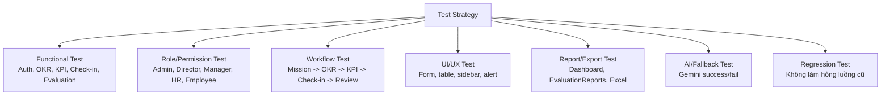

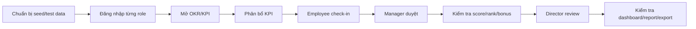

### Lời thoại gợi ý

> Phần kiểm thử tập trung vào các rủi ro lớn: sai nghiệp vụ, sai phân quyền và sai tính toán. Tester kiểm tra từng module như Auth, OKR, KPI, Check-in, Evaluation và Report. Đặc biệt, nhóm test theo luồng end-to-end từ tạo mục tiêu, giao KPI, Employee check-in, Manager duyệt, hệ thống tính điểm, Director review và báo cáo cập nhật. Đây là cách đảm bảo hệ thống đáng tin cậy cho đánh giá nhân sự.

---

## Slide 18 - Test Case Quan Trọng Và Kết Luận

**Người nói:** Tester  
**Thời lượng:** 1 phút

### Nội dung trên slide

| Test case | Kết quả mong đợi |
| --- | --- |
| Employee đăng nhập | Chỉ thấy dữ liệu cá nhân/KPI được giao |
| Employee tạo check-in | Trạng thái là `Pending` |
| Manager duyệt check-in | Check-in `Approved`, cập nhật score/rank/bonus |
| Manager tự duyệt check-in của mình | Bị chặn theo nghiệp vụ |
| Director duyệt EvaluationResult | Trạng thái chuyển `Approved` |
| Role thiếu quyền truy cập module | Bị chặn hoặc vào `AccessDenied` |
| Export Excel báo cáo | Tải được file đúng kỳ đánh giá |
| AI thiếu API key | Có fallback, không ảnh hưởng luồng chính |

### Sơ đồ kết luận

```mermaid
flowchart LR
    A["Chiến lược"] --> B["OKR"]
    B --> C["KPI"]
    C --> D["Check-in"]
    D --> E["Review"]
    E --> F["Score / Rank / Bonus"]
    F --> G["Evaluation"]
    G --> H["Dashboard / Report / AI"]
```

### Lời thoại gợi ý

> Các test case quan trọng nhất xoay quanh phân quyền, check-in, duyệt và tính điểm. Employee chỉ được thấy dữ liệu của mình, check-in phải chờ duyệt, Manager chỉ duyệt đúng phạm vi, Director chốt đánh giá cuối và báo cáo phải phản ánh kết quả. Kết luận lại, VietMach KPI/OKR System không chỉ là nơi nhập KPI, mà là hệ thống quản lý trọn vòng đời từ chiến lược, thực thi, phê duyệt, đánh giá đến báo cáo và AI Insights.

---

## Checklist Trước Khi Đưa Vào PowerPoint

- Tổng thời lượng đúng **20 phút**.
- Mỗi vai trò có phần nói rõ:
  - PO: 3 phút.
  - SM: 3 phút.
  - Luồng hệ thống: 4 phút.
  - Frontend: 3 phút.
  - Backend: 4 phút.
  - Tester: 3 phút.
- Các sơ đồ bắt buộc đã có:
  - Problem/Solution.
  - Scrum workflow.
  - Trello board.
  - Use case.
  - Workflow end-to-end.
  - UI flow.
  - Functional decomposition.
  - Layout frontend.
  - Architecture.
  - Request lifecycle.
  - ERD.
  - Permission/AI.
  - Test strategy.
  - Test flow.
- Khi chuyển sang PowerPoint, nên đưa mỗi sơ đồ lớn lên một slide riêng hoặc giữ đúng slide đã chia ở trên.
- Nếu sơ đồ Mermaid quá nhiều chữ, hãy giữ sơ đồ trong tài liệu và dùng bản rút gọn trên slide trình chiếu.

