# Bài Thuyết Trình Dự Án VietMach KPI/OKR System

> Tài liệu Markdown hoàn chỉnh cho bài thuyết trình 20 phút, chia cho 6 người: PO, SM, Luồng hệ thống, Frontend, Backend và Tester.
>
> Các sơ đồ dùng Mermaid. Khi mở trên GitHub, VS Code có Mermaid preview, hoặc các công cụ Markdown hỗ trợ Mermaid, sơ đồ sẽ được render trực tiếp.

---

## 1. Tổng Quan Bài Thuyết Trình

### 1.1. Tên Đề Tài

**VietMach KPI/OKR System - Hệ thống quản lý KPI/OKR cho doanh nghiệp**

### 1.2. Mục Đích Dự Án

VietMach KPI/OKR System là hệ thống web nội bộ giúp doanh nghiệp quản lý trọn vòng đời hiệu suất:

- Thiết lập tầm nhìn, sứ mệnh và mục tiêu chiến lược.
- Tạo OKR, Key Result và liên kết với KPI.
- Giao KPI cho phòng ban hoặc nhân viên theo kỳ đánh giá.
- Cho phép nhân viên check-in tiến độ KPI.
- Cho phép quản lý duyệt hoặc từ chối check-in.
- Tự động cập nhật tiến độ, điểm số, xếp loại và thưởng dự kiến.
- Hỗ trợ dashboard, báo cáo Excel và AI Insights.

### 1.3. Phân Vai 6 Người Trong 20 Phút

| Vai trò thuyết trình | Thời lượng | Nội dung phụ trách |
| --- | ---: | --- |
| PO | 3 phút | Bài toán, khách hàng, mục tiêu, ý tưởng, phạm vi |
| SM | 3 phút | Scrum, backlog, Trello, Git, sprint, Definition of Done |
| Luồng hệ thống | 4 phút | Use case, workflow, UI flow, phân rã chức năng |
| Frontend | 3 phút | Phong cách thiết kế, giao diện, trải nghiệm người dùng |
| Backend | 4 phút | Kiến trúc kỹ thuật, ERD, database, phân quyền, service, AI |
| Tester | 3 phút | Test plan, test case, đảm bảo chất lượng |

### 1.4. Agenda Tổng Thể

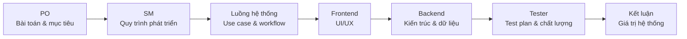

---

## 2. Phần PO - Phân Tích Bài Toán Và Giá Trị Sản Phẩm

### 2.1. Thực Trạng

Nhiều doanh nghiệp quản lý KPI/OKR bằng Excel, Google Sheet hoặc các file riêng lẻ. Cách làm này có một số vấn đề:

- Mục tiêu chiến lược và KPI hằng ngày không được liên kết rõ.
- Nhân viên cập nhật tiến độ nhưng quản lý khó kiểm chứng.
- Dữ liệu KPI, check-in, đánh giá và báo cáo bị phân tán.
- Việc tính điểm, xếp loại và thưởng dễ sai lệch nếu làm thủ công.
- Không có lịch sử duyệt rõ ràng để truy vết trách nhiệm.
- Người dùng ở các vai trò khác nhau có thể bị lẫn phạm vi dữ liệu.

### 2.2. Thu Thập Ý Kiến Khách Hàng

Qua phân tích nhu cầu của doanh nghiệp, hệ thống cần giải quyết các nhóm yêu cầu sau:

| Nhóm người dùng | Nhu cầu chính |
| --- | --- |
| Ban giám đốc | Theo dõi mục tiêu chiến lược, kết quả toàn công ty, phê duyệt đánh giá cuối |
| Quản lý phòng ban | Giao KPI, theo dõi nhân viên, duyệt check-in, gửi đánh giá lên giám đốc |
| HR | Quản lý nhân sự, kỳ đánh giá, xếp loại, thưởng và báo cáo |
| Nhân viên | Xem KPI được giao, check-in tiến độ, xem kết quả cá nhân |
| Admin | Quản trị tài khoản, vai trò, quyền, danh mục và audit log |

### 2.3. Sơ Đồ Từ Vấn Đề Đến Giải Pháp

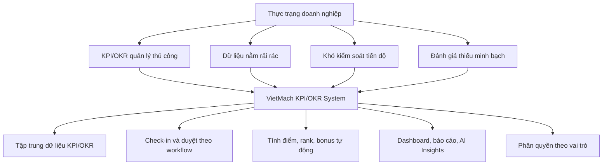

### 2.4. Môi Trường Và Lĩnh Vực Áp Dụng

Hệ thống phù hợp với:

- Doanh nghiệp vừa và nhỏ cần quản lý hiệu suất nhân viên.
- Công ty có nhiều phòng ban và nhiều cấp quản lý.
- Tổ chức vận hành theo kỳ đánh giá tháng, quý hoặc năm.
- Môi trường cần kết nối mục tiêu chiến lược với công việc thực thi.
- Bộ phận HR cần dữ liệu để đánh giá, xếp loại và tính thưởng.

### 2.5. Quy Mô Dự Án

Dự án không chỉ là một màn hình nhập KPI. Hệ thống gồm nhiều module liên kết:

- Authentication và tài khoản người dùng.
- Role, Permission và phân quyền theo nghiệp vụ.
- Department, Position, Employee.
- Mission/Vision, OKR, Key Result.
- KPI, KPI Detail, KPI Assignment.
- KPI Check-in, Review Queue, Check-in History.
- Evaluation Result, Grading Rank, Bonus Rule.
- Dashboard, Evaluation Report, Export Excel.
- AI Chat, Suggest KPI, Analyze Performance, Smart Alerts.
- Audit Log và Notification.

### 2.6. Mục Tiêu, Ý Tưởng Và Tầm Nhìn

**Mục tiêu:** số hóa quy trình quản trị hiệu suất từ chiến lược đến đánh giá cuối kỳ.

**Ý tưởng:** xây dựng một hệ thống trung tâm, nơi mọi mục tiêu, KPI, check-in và đánh giá đều được lưu, duyệt và báo cáo trong cùng một luồng.

**Tầm nhìn:** giúp doanh nghiệp quản lý KPI/OKR minh bạch, có dữ liệu, có phân quyền và có khả năng mở rộng cho nhiều phòng ban.

### 2.7. Lời Nói Gợi Ý Cho PO

> Phần đầu tiên, em xin trình bày về bài toán sản phẩm. Trong thực tế, nhiều doanh nghiệp vẫn quản lý KPI/OKR bằng Excel hoặc các file riêng lẻ. Cách làm này khiến mục tiêu chiến lược, KPI hằng ngày, check-in tiến độ và đánh giá cuối kỳ bị tách rời. Vì vậy, nhóm xây dựng VietMach KPI/OKR System để gom toàn bộ quy trình này vào một hệ thống web tập trung. Hệ thống giúp doanh nghiệp tạo mục tiêu, giao KPI, theo dõi check-in, duyệt kết quả, tính điểm, xếp loại, thưởng dự kiến và xem báo cáo.

---

## 3. Phần SM - Quy Trình Phát Triển Và Quản Lý Backlog

### 3.1. Cách Nhóm Quản Lý Dự Án

Nhóm áp dụng tư duy Scrum để chia dự án thành các phần nhỏ, dễ theo dõi:

- Product backlog chứa toàn bộ yêu cầu nghiệp vụ.
- Sprint backlog chọn các yêu cầu ưu tiên cho từng giai đoạn.
- Trello dùng để quản lý trạng thái công việc.
- Git dùng để quản lý mã nguồn, lịch sử thay đổi và phối hợp giữa các thành viên.
- Review sau mỗi sprint để kiểm tra tiến độ và chất lượng.

### 3.2. Sơ Đồ Quy Trình Scrum

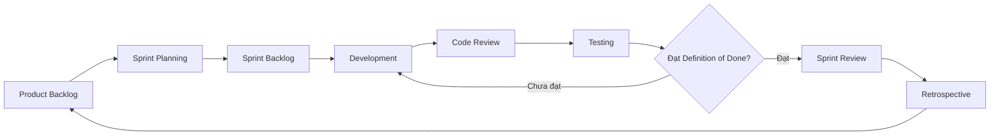

### 3.3. Sơ Đồ Trello Board

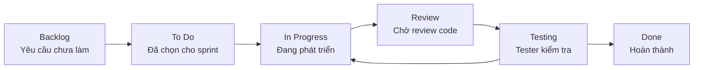

### 3.4. Sprint Backlog Mẫu Theo Module

| Sprint | Module trọng tâm | Kết quả mong muốn |
| --- | --- | --- |
| Sprint 1 | Auth, Role, Permission, User | Đăng nhập, phân quyền, quản trị tài khoản |
| Sprint 2 | Department, Position, Employee | Quản lý dữ liệu nền tảng tổ chức |
| Sprint 3 | Mission/Vision, OKR, Key Result | Thiết lập mục tiêu chiến lược và OKR |
| Sprint 4 | KPI, KPI Detail, Assignment | Tạo, duyệt, phân bổ KPI |
| Sprint 5 | Check-in, Review Queue | Nhân viên check-in và quản lý duyệt |
| Sprint 6 | Evaluation, Report, AI | Đánh giá, báo cáo, AI Insights |

### 3.5. Definition Of Done

Một task chỉ được xem là hoàn thành khi:

- Tính năng chạy được trên môi trường local.
- Đúng nghiệp vụ đã mô tả trong backlog.
- Đúng phân quyền theo vai trò.
- Có validation dữ liệu đầu vào.
- Giao diện không vỡ layout.
- Tester đã chạy test case chính.
- Không làm hỏng luồng cũ.
- Có commit rõ nội dung thay đổi.

### 3.6. Lời Nói Gợi Ý Cho SM

> Với vai trò Scrum Master, em trình bày cách nhóm quản lý công việc. Vì dự án có nhiều module liên kết với nhau, nhóm chia backlog theo từng cụm nghiệp vụ như Auth, HR, OKR, KPI, Check-in, Evaluation và Report. Trello giúp nhóm biết task đang ở trạng thái nào, còn Git giúp theo dõi thay đổi mã nguồn. Definition of Done của nhóm không chỉ là code xong, mà còn phải đúng nghiệp vụ, đúng phân quyền, có validation và đã được tester kiểm tra.

---

## 4. Phần Luồng Hệ Thống - Use Case, Workflow Và UI Flow

### 4.1. Tác Nhân Chính

| Tác nhân | Trách nhiệm |
| --- | --- |
| Admin | Quản trị hệ thống, role, permission, user, catalog, audit |
| Director | Quản lý mục tiêu cấp công ty, xem dashboard toàn hệ thống, duyệt đánh giá cuối |
| Manager | Tạo/phân bổ KPI, duyệt check-in, gửi đánh giá lên Director |
| HR | Quản lý nhân sự, kỳ đánh giá, bonus rule, báo cáo nhân sự |
| Employee/Sales | Xem KPI được giao, check-in tiến độ, xem kết quả cá nhân |
| AI Service | Hỗ trợ phân tích, gợi ý KPI, cảnh báo thông minh theo phạm vi quyền |

### 4.2. Sơ Đồ Use Case Tổng Quát

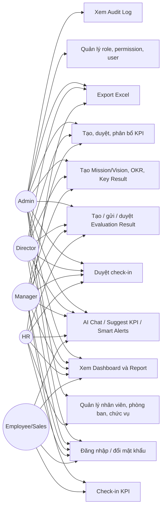

### 4.3. Sơ Đồ Workflow Nghiệp Vụ End-To-End

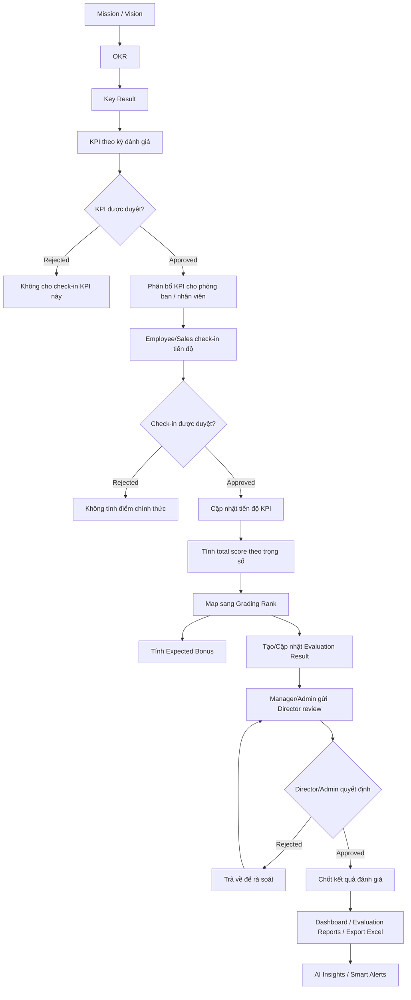

### 4.4. Sơ Đồ Sequence Cho Luồng KPI Check-in

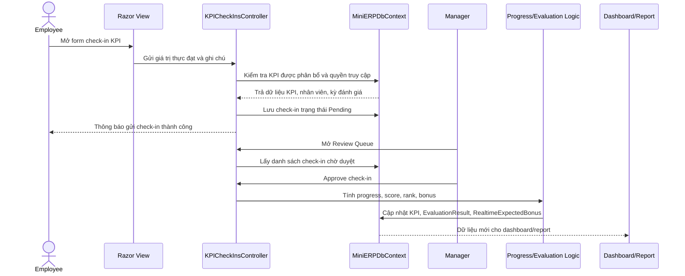

### 4.5. Sơ Đồ Trạng Thái Check-in

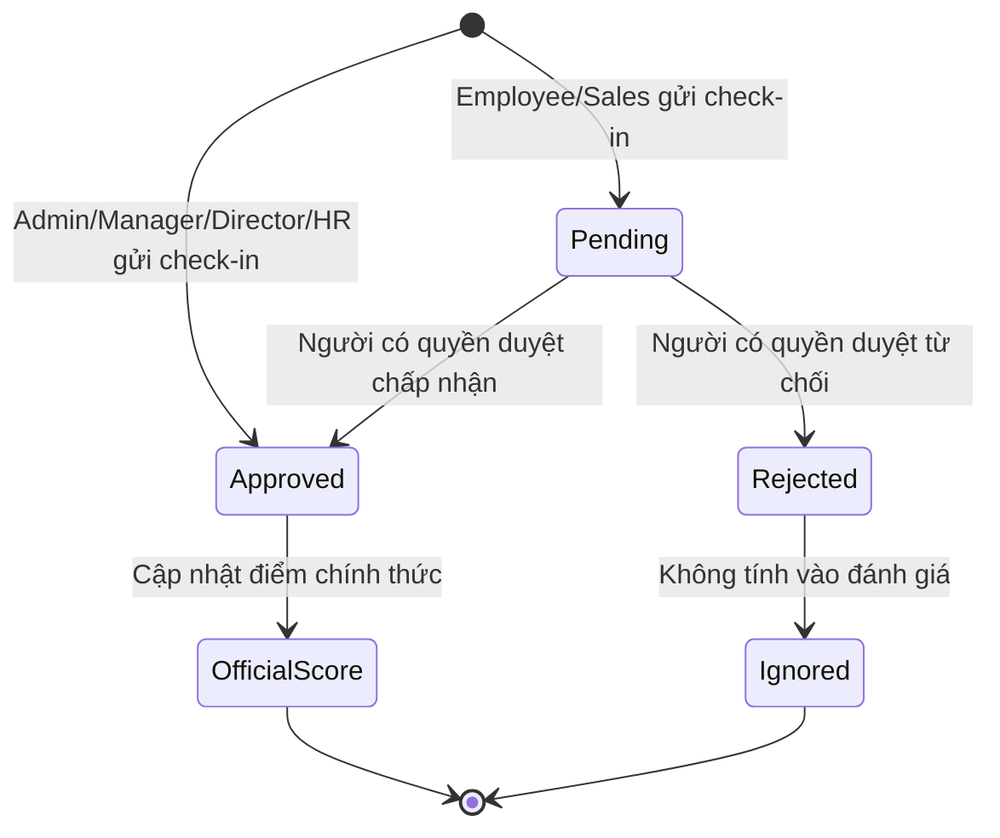

### 4.6. Sơ Đồ Trạng Thái Evaluation Result

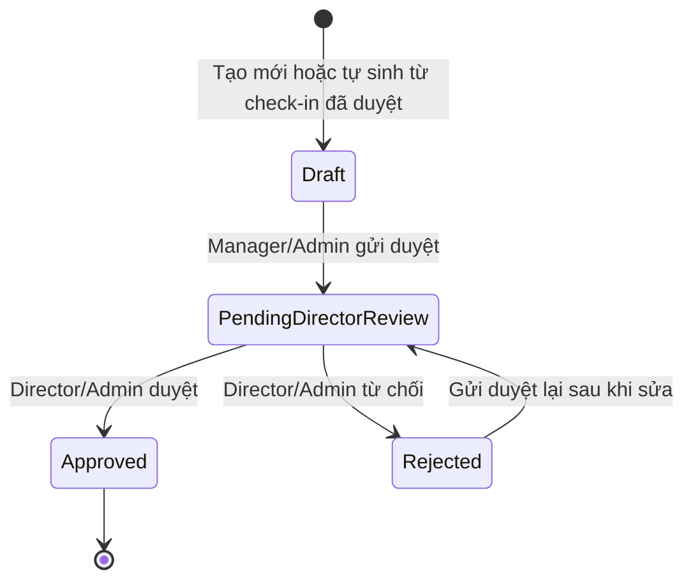

### 4.7. Sơ Đồ UI Flow Theo Vai Trò

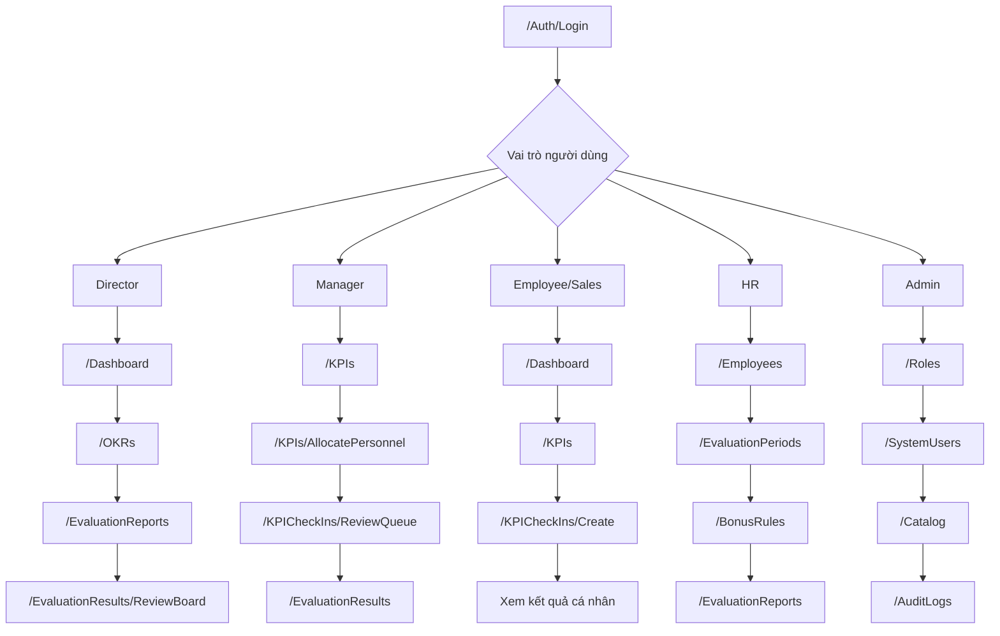

### 4.8. Mô Hình Phân Rã Chức Năng

```mermaid
flowchart TD
    Root["VietMach KPI/OKR System"]

    Root --> Foundation["Nền tảng hệ thống"]
    Foundation --> F1["Auth / Google OAuth / OTP"]
    Foundation --> F2["Role / Permission"]
    Foundation --> F3["System User"]
    Foundation --> F4["Audit Log"]

    Root --> Organization["Tổ chức & nhân sự"]
    Organization --> O1["Department"]
    Organization --> O2["Position"]
    Organization --> O3["Employee"]
    Organization --> O4["Employee Assignment"]

    Root --> Strategy["Chiến lược & OKR"]
    Strategy --> S1["Mission / Vision"]
    Strategy --> S2["OKR"]
    Strategy --> S3["Key Result"]
    Strategy --> S4["OKR Allocation"]

    Root --> KPI["KPI Management"]
    KPI --> K1["Evaluation Period"]
    KPI --> K2["KPI Type / Property"]
    KPI --> K3["KPI / KPI Detail"]
    KPI --> K4["KPI Assignment"]
    KPI --> K5["KPI Approval"]

    Root --> Execution["Execution & Check-in"]
    Execution --> C1["KPI Check-in"]
    Execution --> C2["Review Queue"]
    Execution --> C3["Check-in History"]
    Execution --> C4["Goal Comment"]

    Root --> Evaluation["Evaluation & Reward"]
    Evaluation --> E1["Evaluation Result"]
    Evaluation --> E2["Director Review"]
    Evaluation --> E3["Grading Rank"]
    Evaluation --> E4["Bonus Rule"]
    Evaluation --> E5["Realtime Expected Bonus"]

    Root --> ReportAI["Report & AI"]
    ReportAI --> R1["Dashboard"]
    ReportAI --> R2["Evaluation Report"]
    ReportAI --> R3["Export Excel"]
    ReportAI --> R4["AI Chat"]
    ReportAI --> R5["Suggest KPI"]
    ReportAI --> R6["Smart Alerts"]
```

### 4.9. Lời Nói Gợi Ý Cho Luồng Hệ Thống

> Em sẽ trình bày cách hệ thống vận hành từ đầu đến cuối. Người dùng đầu tiên đăng nhập, sau đó hệ thống xác định vai trò và quyền. Luồng nghiệp vụ bắt đầu từ Mission/Vision, tiếp theo là OKR và Key Result. Từ Key Result, hệ thống tạo KPI theo kỳ đánh giá. KPI cần được duyệt trước khi phân bổ cho phòng ban hoặc nhân viên. Khi nhân viên check-in, bản ghi đi vào trạng thái Pending. Manager, Director, HR hoặc Admin sẽ duyệt. Nếu check-in được duyệt, hệ thống tự động cập nhật tiến độ KPI, tính điểm, xếp loại, thưởng dự kiến và tạo hoặc cập nhật kết quả đánh giá. Cuối cùng, Manager gửi kết quả lên Director để duyệt, sau đó dữ liệu xuất hiện trên dashboard và báo cáo.

---

## 5. Phần Frontend - Giao Diện Và Trải Nghiệm Người Dùng

### 5.1. Phong Cách Thiết Kế

Giao diện theo phong cách enterprise dashboard:

- Màu chủ đạo là xanh dương chuyên nghiệp.
- Nền sáng, dễ đọc dữ liệu.
- Sidebar xanh đậm, cố định bên trái.
- Dashboard cards để tóm tắt số liệu.
- Bảng dữ liệu cho danh sách KPI, OKR, nhân viên, báo cáo.
- Form nhập liệu rõ ràng cho KPI, check-in, evaluation.
- Alert và notification giúp phản hồi thao tác.

### 5.2. Thành Phần Giao Diện Chính

| Màn hình | Vai trò |
| --- | --- |
| Login | Đăng nhập username/password hoặc Google OAuth |
| Dashboard | Xem tổng quan KPI/OKR/check-in theo kỳ đánh giá |
| OKRs | Quản lý OKR, Key Result, tiến độ mục tiêu |
| KPIs | Tạo, duyệt, từ chối, phân bổ KPI |
| KPICheckIns | Nhân viên check-in tiến độ KPI |
| ReviewQueue | Quản lý duyệt check-in |
| EvaluationResults | Quản lý kết quả đánh giá |
| EvaluationReports | Báo cáo, tổng hợp, export Excel |
| AI Widget | Chat, phân tích, gợi ý và cảnh báo |

### 5.3. Sơ Đồ Layout Giao Diện

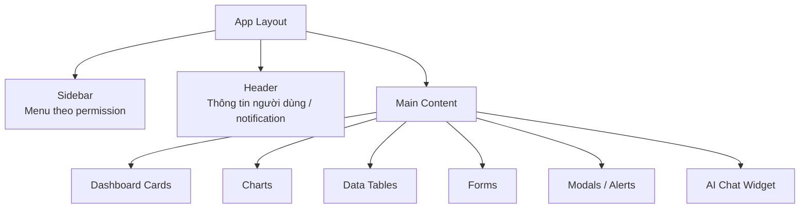

### 5.4. Sơ Đồ Điều Hướng Frontend

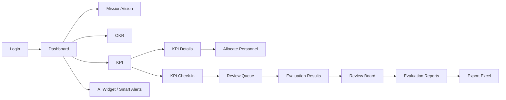

### 5.5. UX Theo Trạng Thái Nghiệp Vụ

| Trạng thái | Ý nghĩa UX |
| --- | --- |
| Pending | Người dùng biết dữ liệu đang chờ duyệt |
| Approved | Dữ liệu đã được xác nhận và có thể tính điểm |
| Rejected | Dữ liệu bị từ chối, cần xem lý do hoặc chỉnh sửa |
| Draft | Kết quả đánh giá đang nháp |
| PendingDirectorReview | Đánh giá đang chờ Director duyệt |

### 5.6. Lời Nói Gợi Ý Cho Frontend

> Về frontend, nhóm chọn phong cách enterprise dashboard vì hệ thống phục vụ quản lý nội bộ và cần hiển thị nhiều dữ liệu. Sidebar giúp người dùng truy cập nhanh các module, nhưng menu được hiển thị theo permission nên mỗi vai trò chỉ thấy chức năng phù hợp. Các màn hình như Dashboard, OKR, KPI, Check-in và Evaluation Report được thiết kế quanh bảng dữ liệu, form và biểu đồ. Mục tiêu UX là giúp người dùng hiểu rõ mình đang ở bước nào của workflow, đặc biệt với các trạng thái Pending, Approved, Rejected và PendingDirectorReview.

---

## 6. Phần Backend - Kiến Trúc Kỹ Thuật, ERD Và Phân Quyền

### 6.1. Tech Stack

| Thành phần | Công nghệ |
| --- | --- |
| Backend | ASP.NET Core MVC, .NET 10 |
| ORM | Entity Framework Core 10 |
| Database | SQL Server |
| Authentication | Cookie Authentication, Google OAuth |
| Authorization | Role/Permission, `HasPermissionAttribute` |
| UI Rendering | Razor Views |
| Frontend Libraries | Bootstrap, jQuery, Select2, Chart.js, SweetAlert2 |
| Export | EPPlus |
| AI | Gemini API qua `GeminiService` |
| Config | DotNetEnv, appsettings, environment variables |
| Deployment | IIS, ASP.NET Core Module V2 |

### 6.2. Sơ Đồ Kiến Trúc Tổng Quan

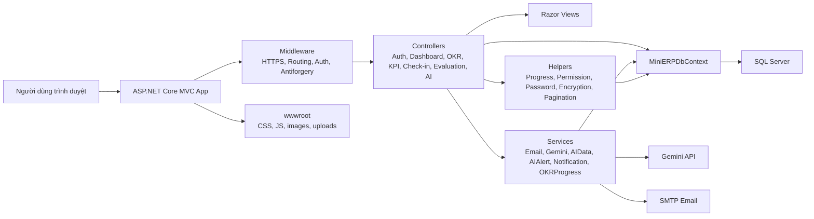

### 6.3. Sơ Đồ Cấu Trúc Phân Tầng

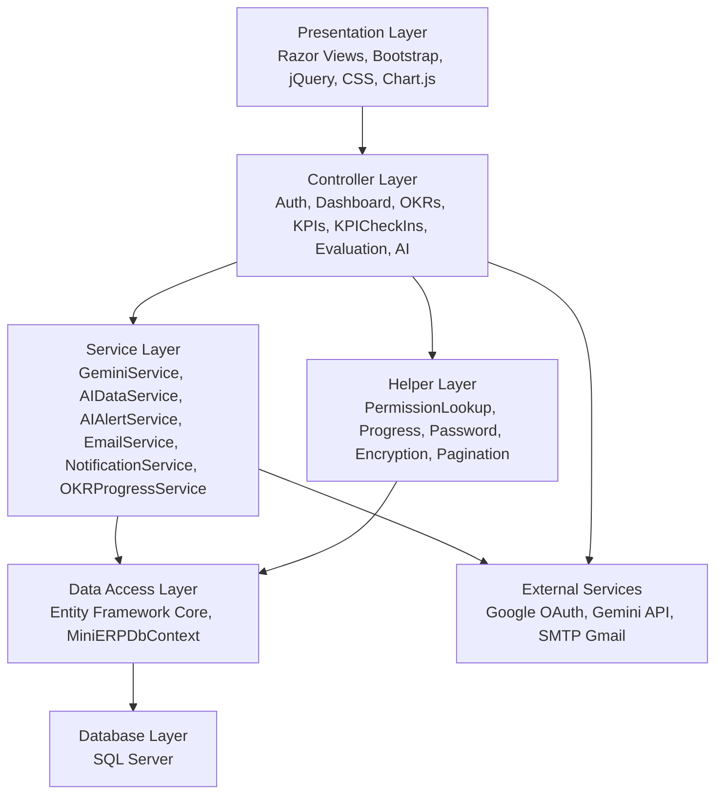

### 6.4. Sơ Đồ Request Lifecycle

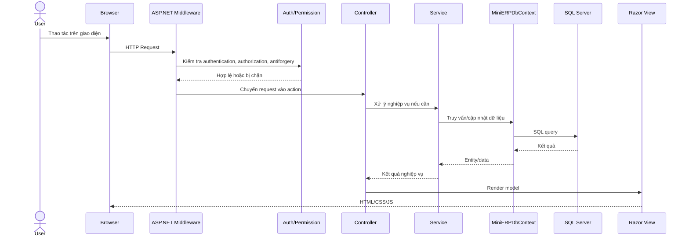

### 6.5. Sơ Đồ ERD Rút Gọn

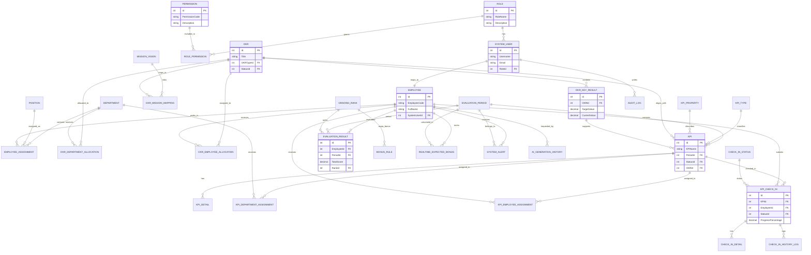

### 6.6. Sơ Đồ Phân Quyền

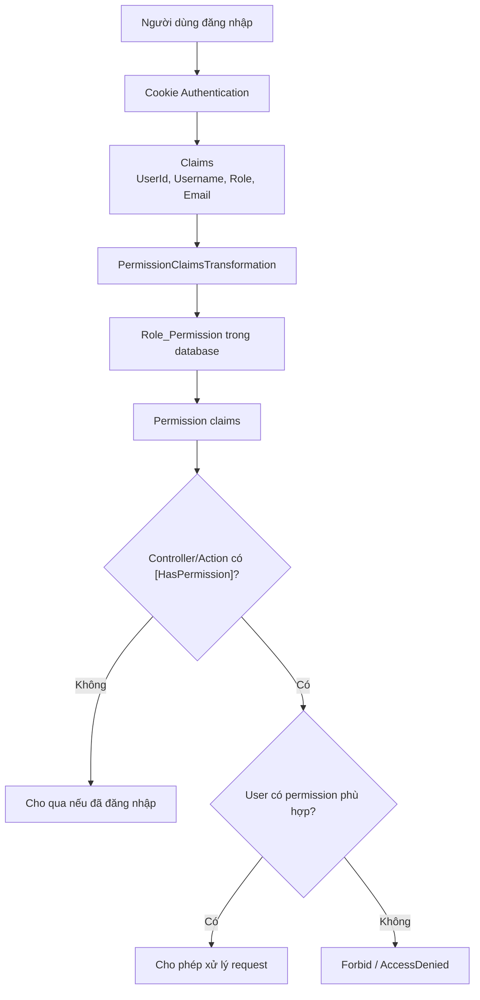

### 6.7. Sơ Đồ Tích Hợp AI

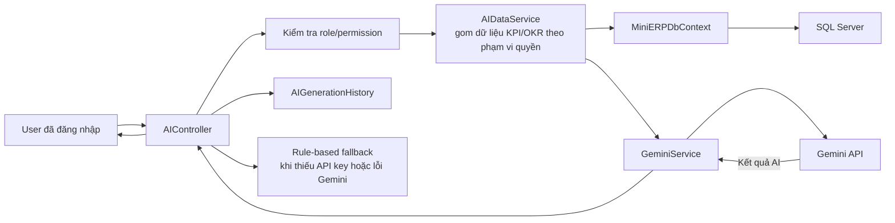

### 6.8. Lời Nói Gợi Ý Cho Backend

> Về backend, hệ thống được xây dựng bằng ASP.NET Core MVC và Entity Framework Core với SQL Server. Request đi từ browser qua middleware, sau đó vào controller. Controller gọi service hoặc DbContext để xử lý nghiệp vụ. Điểm quan trọng là phân quyền được kiểm soát cả ở backend bằng Authorize và HasPermission, không chỉ ẩn menu ở giao diện. Database được chia thành các nhóm bảng: nền tảng tổ chức, OKR, KPI, check-in, evaluation, report và AI. Ngoài ra, hệ thống tích hợp Gemini API để hỗ trợ phân tích, gợi ý KPI và smart alerts, nhưng AI chỉ hoạt động trong phạm vi dữ liệu người dùng được quyền xem.

---

## 7. Phần Tester - Test Plan, Test Case Và Đảm Bảo Chất Lượng

### 7.1. Mục Tiêu Kiểm Thử

Tester cần đảm bảo:

- Hệ thống đúng luồng nghiệp vụ KPI/OKR.
- Mỗi vai trò chỉ xem và thao tác đúng phạm vi.
- Check-in, review, score, rank, bonus hoạt động đúng.
- Evaluation Result chuyển trạng thái đúng.
- Dashboard và report phản ánh dữ liệu sau khi duyệt.
- Giao diện không gây nhầm lẫn trạng thái.
- AI không làm lộ dữ liệu ngoài phạm vi quyền.

### 7.2. Sơ Đồ Test Strategy

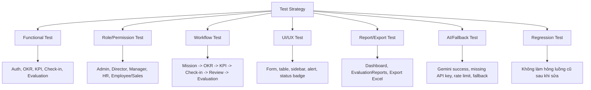

### 7.3. Sơ Đồ Luồng Kiểm Thử End-To-End

```mermaid
flowchart LR
    A["Chuẩn bị dữ liệu seed/test"] --> B["Đăng nhập theo từng role"]
    B --> C["Tạo hoặc mở OKR/KPI"]
    C --> D["Phân bổ KPI"]
    D --> E["Employee check-in"]
    E --> F["Manager duyệt check-in"]
    F --> G["Kiểm tra score/rank/bonus"]
    G --> H["Manager gửi evaluation"]
    H --> I["Director duyệt"]
    I --> J["Kiểm tra dashboard/report/export"]
```

### 7.4. Test Case Mẫu

| ID | Test case | Vai trò | Kết quả mong đợi |
| --- | --- | --- | --- |
| TC01 | Đăng nhập đúng tài khoản | Tất cả | Vào dashboard theo quyền |
| TC02 | Đăng nhập sai mật khẩu | Tất cả | Hiển thị lỗi đăng nhập |
| TC03 | Employee xem KPI | Employee | Chỉ thấy KPI được giao |
| TC04 | Employee tạo check-in | Employee | Check-in ở trạng thái Pending |
| TC05 | Manager mở ReviewQueue | Manager | Chỉ thấy check-in trong phạm vi quản lý |
| TC06 | Manager duyệt check-in | Manager | Check-in Approved, cập nhật điểm |
| TC07 | Manager tự duyệt check-in của mình | Manager | Bị chặn theo nghiệp vụ |
| TC08 | Director duyệt EvaluationResult | Director | Trạng thái chuyển Approved |
| TC09 | Role thiếu quyền truy cập module | Employee | Bị chuyển AccessDenied hoặc Forbid |
| TC10 | Export Excel báo cáo | HR/Director/Admin | Tạo file báo cáo đúng kỳ đánh giá |
| TC11 | AI phân tích dữ liệu cá nhân | Employee | Chỉ dùng dữ liệu cá nhân |
| TC12 | Thiếu Gemini API key | Tất cả | Có cảnh báo/fallback, không làm hỏng luồng chính |

### 7.5. Ma Trận Kiểm Thử Theo Vai Trò

| Module | Admin | Director | Manager | HR | Employee/Sales |
| --- | --- | --- | --- | --- | --- |
| Role/Permission | CRUD | Không mặc định | Không | Không | Không |
| Employee | CRUD | Xem theo quyền | Xem theo quyền | CRUD | Không |
| OKR | CRUD | CRUD chiến lược | CRUD theo phạm vi | Xem | Xem liên quan |
| KPI | CRUD/Approve/Assign | CRUD/Approve/Assign | CRUD/Approve/Assign theo phạm vi | Xem theo quyền | Xem KPI được giao |
| Check-in | Xem/duyệt tất cả | Xem/duyệt tất cả | Duyệt theo phòng ban | Xem/duyệt theo quyền | Tạo cá nhân |
| Evaluation | CRUD/duyệt | Duyệt cuối | Tạo/gửi duyệt theo phòng ban | Tạo/sửa theo quyền | Xem cá nhân |
| Report | Xem/export | Xem/export | Xem theo phạm vi | Xem/export | Xem cá nhân |
| AI | Toàn quyền theo dữ liệu | Toàn công ty | Theo phòng ban | Theo HR | Cá nhân |

### 7.6. Lời Nói Gợi Ý Cho Tester

> Về kiểm thử, nhóm tập trung vào ba rủi ro lớn: sai nghiệp vụ, sai phân quyền và sai tính toán. Với một hệ thống đánh giá nhân sự, nếu tính sai điểm hoặc cho sai người duyệt check-in thì kết quả cuối kỳ sẽ không đáng tin cậy. Vì vậy, tester kiểm tra theo workflow end-to-end: Employee check-in, Manager duyệt, hệ thống tính điểm và rank, Manager gửi evaluation, Director duyệt, sau đó dashboard và báo cáo phải cập nhật. Ngoài ra, tester cũng kiểm tra các trường hợp bị chặn quyền và fallback của AI khi thiếu API key.

---

## 8. Outline Slide Đề Xuất Cho PowerPoint

| Slide | Người nói | Thời lượng | Nội dung chính |
| --- | --- | ---: | --- |
| 1 | PO | 0.5 phút | Tên đề tài, thành viên theo vai trò |
| 2 | PO | 1 phút | Thực trạng và nhu cầu khách hàng |
| 3 | PO | 1 phút | Môi trường áp dụng, quy mô, tầm nhìn |
| 4 | PO | 0.5 phút | Chức năng chính/phụ/phi chức năng |
| 5 | SM | 1 phút | Scrum workflow |
| 6 | SM | 1 phút | Backlog, Trello, Git |
| 7 | SM | 1 phút | Definition of Done |
| 8 | Luồng hệ thống | 1 phút | Use case và tác nhân |
| 9 | Luồng hệ thống | 1.5 phút | Workflow end-to-end |
| 10 | Luồng hệ thống | 1 phút | UI flow theo vai trò |
| 11 | Luồng hệ thống | 0.5 phút | Phân rã chức năng và phân tầng |
| 12 | Frontend | 1 phút | Phong cách thiết kế |
| 13 | Frontend | 1.25 phút | Giao diện hệ thống |
| 14 | Frontend | 0.75 phút | UX, trạng thái, validation |
| 15 | Backend | 2 phút | Kiến trúc, request lifecycle, service |
| 16 | Backend | 2 phút | ERD, phân quyền, AI |
| 17 | Tester | 2 phút | Test plan và test flow |
| 18 | Tester | 1 phút | Test case, kết luận |

---

## 9. Kịch Bản Nói Ngắn Theo Từng Vai Trò

### 9.1. PO

> Xin chào thầy cô và các bạn. Nhóm em trình bày đề tài VietMach KPI/OKR System. Đây là hệ thống web giúp doanh nghiệp quản lý KPI/OKR từ mục tiêu chiến lược đến đánh giá cuối kỳ. Vấn đề nhóm nhận thấy là nhiều doanh nghiệp vẫn quản lý KPI bằng Excel hoặc các file rời rạc, khiến việc theo dõi tiến độ, duyệt kết quả và tổng hợp báo cáo mất nhiều thời gian. Hệ thống của nhóm giải quyết bằng cách tập trung dữ liệu, phân quyền rõ ràng và tự động hóa các bước tính điểm, xếp loại, thưởng dự kiến.

### 9.2. SM

> Để phát triển hệ thống có nhiều module, nhóm áp dụng Scrum. Product backlog được chia theo các nhóm nghiệp vụ như Auth, HR, OKR, KPI, Check-in, Evaluation và Report. Mỗi sprint chọn ra một nhóm yêu cầu ưu tiên, chia task cho frontend, backend và tester. Trello dùng để theo dõi trạng thái công việc, Git dùng để quản lý mã nguồn. Một task chỉ Done khi chạy được, đúng nghiệp vụ, đúng phân quyền, có validation và đã test luồng chính.

### 9.3. Luồng Hệ Thống

> Luồng hệ thống bắt đầu từ Mission/Vision, sau đó tạo OKR và Key Result. Từ Key Result, hệ thống tạo KPI theo kỳ đánh giá và phân bổ cho phòng ban hoặc nhân viên. Nhân viên check-in tiến độ KPI, check-in đi vào trạng thái Pending. Manager hoặc người có quyền review sẽ duyệt. Nếu Approved, hệ thống tính tiến độ, score, rank, expected bonus và cập nhật EvaluationResult. Cuối cùng, Manager gửi kết quả lên Director duyệt và dữ liệu được đưa lên dashboard, báo cáo và AI Insights.

### 9.4. Frontend

> Frontend được thiết kế theo phong cách enterprise dashboard, dùng màu xanh dương chuyên nghiệp, sidebar cố định và nội dung dạng bảng, form, card, biểu đồ. Sidebar hiển thị theo permission nên mỗi vai trò chỉ thấy chức năng phù hợp. Các trạng thái như Pending, Approved, Rejected, Draft và PendingDirectorReview được thể hiện rõ để người dùng hiểu dữ liệu đang ở bước nào của quy trình.

### 9.5. Backend

> Backend dùng ASP.NET Core MVC, Entity Framework Core và SQL Server. Request đi qua middleware, authentication, authorization, sau đó vào controller. Controller gọi service hoặc DbContext để xử lý nghiệp vụ. Hệ thống phân quyền bằng Role, Permission và HasPermissionAttribute. Database được chia theo các nhóm foundation, OKR, KPI, check-in, evaluation, report và AI. Ngoài ra, hệ thống tích hợp Gemini API để hỗ trợ chat, gợi ý KPI, phân tích hiệu suất và smart alerts trong phạm vi dữ liệu người dùng được phép xem.

### 9.6. Tester

> Kiểm thử tập trung vào các luồng có rủi ro cao: phân quyền, check-in, duyệt, tính điểm, xếp loại và báo cáo. Tester kiểm tra từng role, ví dụ Employee chỉ thấy KPI được giao, Manager chỉ duyệt check-in trong phạm vi phòng ban, Director duyệt evaluation cuối, và role không có quyền thì bị chặn. Sau khi check-in được duyệt, dashboard và report phải phản ánh dữ liệu mới. Đây là cơ sở để đảm bảo hệ thống đáng tin cậy khi dùng cho đánh giá nhân sự.

---

## 10. Checklist Sơ Đồ Cần Có Khi Làm Slide

| Sơ đồ | Nên đưa vào slide | Mục đích |
| --- | --- | --- |
| Agenda tổng thể | Có | Giới thiệu cấu trúc bài nói |
| Problem/Solution | Có | Làm rõ lý do cần dự án |
| Scrum workflow | Có | Trình bày cách nhóm làm việc |
| Trello board | Có | Chứng minh quản lý backlog/sprint |
| Use case tổng quát | Có | Thể hiện tác nhân và chức năng |
| Workflow end-to-end | Bắt buộc | Sơ đồ quan trọng nhất về nghiệp vụ |
| Sequence check-in | Có | Làm rõ tương tác giữa user và system |
| State check-in | Có | Giải thích Pending/Approved/Rejected |
| State evaluation | Có | Giải thích Director review |
| UI flow theo vai trò | Có | Thể hiện đường đi của từng người dùng |
| Phân rã chức năng | Có | Thể hiện quy mô module |
| Layout UI | Tùy chọn | Phục vụ phần Frontend |
| Kiến trúc tổng quan | Bắt buộc | Phục vụ phần Backend |
| Cấu trúc phân tầng | Có | Giải thích cách tổ chức hệ thống |
| Request lifecycle | Có | Giải thích luồng request kỹ thuật |
| ERD rút gọn | Bắt buộc | Phục vụ phân tích database |
| Phân quyền | Bắt buộc | Làm rõ bảo mật role/permission |
| AI integration | Có | Làm rõ Gemini và phạm vi dữ liệu |
| Test strategy | Có | Phục vụ phần Tester |
| Test flow end-to-end | Có | Chứng minh kiểm thử theo nghiệp vụ |

---

## 11. Kết Luận

VietMach KPI/OKR System không chỉ là hệ thống nhập KPI, mà là một giải pháp quản lý hiệu suất trọn vòng đời:

- Từ chiến lược đến OKR và KPI.
- Từ KPI đến check-in thực tế.
- Từ check-in đến duyệt, tính điểm, rank và bonus.
- Từ evaluation đến báo cáo, dashboard và AI Insights.
- Từ người dùng cá nhân đến quản trị toàn hệ thống bằng role/permission.

Câu chốt đề xuất:

> Hệ thống giúp doanh nghiệp biến KPI/OKR từ một quy trình thủ công, rời rạc thành một luồng quản trị hiệu suất tập trung, minh bạch, có kiểm soát và có dữ liệu để ra quyết định.

