# QUY TRÌNH TRÌNH BÀY VÀ DEMO DỰ ÁN TRONG 20 PHÚT

> **Chủ đề:** Hệ thống KPI/OKR AI-native — từ mục tiêu đến công việc, check-in và đánh giá có bằng chứng.<br>
> **Thông điệp xuyên suốt:** **AI đề xuất, con người quyết định.**<br>
> **Model AI trình diễn:** **DeepSeek V4 Pro** (`deepseek-v4-pro`).<br>
> **Thời lượng:** đúng 20 phút, đủ 7 thành viên tham gia.<br>
> **Ưu tiên:** AI có nguồn, liên kết nghiệp vụ xuyên suốt, vận hành bền vững và bằng chứng kiểm thử.

---

## 1. Câu chuyện demo duy nhất

Toàn bộ nhóm dùng cùng một tình huống để tránh trình bày rời rạc:

> Doanh nghiệp đặt Objective **“Nâng tỷ lệ hoàn thành công việc đúng hạn trong Q3 lên 95%”**. Hệ thống liên kết Objective → KR/KPI → project → task → check-in. Goal Planning Agent đề xuất kế hoạch có nguồn; quản lý xác nhận mới tạo task. Khi nhân viên check-in, AI Evaluator đưa ra đánh giá tham khảo, confidence, citation và data gap; người duyệt vẫn quyết định dữ liệu chính thức.

### Bốn điểm đột phá cần làm hội đồng nhớ

1. **Liên thông chiến lược đến thực thi:** OKR/KR/KPI → project/task → check-in → đánh giá.
2. **AI giải thích được:** đề xuất có citation, source fingerprint, confidence và cơ chế abstain khi thiếu bằng chứng.
3. **AI không tự quyết định:** mọi thay đổi chính thức phải qua xác nhận, validator và transaction của người có quyền.
4. **Vận hành an toàn:** tenant/RLS, ACL tài liệu, outbox bền vững, retry, idempotency và kiểm thử SQL Server thật.

---

## 2. Sơ đồ luồng trình bày

```mermaid
flowchart LR
    A[Quân<br/>Bài toán & thông điệp] --> B[Phong<br/>Nền giao diện]
    B --> C[Như<br/>KPI/OKR frontend]
    C --> D[An<br/>Liên kết backend]
    D --> E[Quân<br/>Goal Planning AI]
    E --> F[Quân<br/>Check-in AI Evaluator]
    F --> G[Nhật<br/>Giao diện vận hành]
    G --> H[Bảo<br/>Quy trình vận hành]
    H --> I[Khánh<br/>Bằng chứng kiểm thử]
    I --> J[Quân<br/>Kết luận & phản biện]
```



```text
Mục tiêu ──► KPI/KR ──► AI lập 3 kế hoạch ──► Người duyệt ──► Project/Task
                                                          │
                                                          ▼
Tài liệu có ACL ──► RAG/Citation ──► Check-in AI ──► Bản nháp review ──► Người quyết định
```

---

## 3. Phân vai 7 thành viên

| Thành viên | Phạm vi phụ trách | Vai trò trong demo |
|---|---|---|
| **Quân — Nhóm trưởng** | Chức năng AI | Mở bài, demo Goal Planning + Check-in AI, kết luận và trả lời câu hỏi AI |
| **Như** | Frontend KPI/OKR | Trình bày giao diện, luồng thao tác và liên kết trực quan KPI/OKR |
| **An** | Backend KPI/OKR | Giải thích kiểm tra nghiệp vụ, liên kết dữ liệu, transaction và quyền ghi |
| **Nhật** | Giao diện vận hành | Trình bày màn hình vận hành AI/RAG, trạng thái, metrics và calibration |
| **Bảo** | Chức năng vận hành | Trình bày upload/ACL/index/outbox/retry và cơ chế fail-safe |
| **Phong** | Frontend SEO và chức năng nền | Trình bày landing, điều hướng, responsive, role-based UI và nền sản phẩm |
| **Khánh** | Tester | Trình bày chiến lược kiểm thử, `586/586`, SQL Server/RLS/concurrency; đồng thời giữ thời gian |

### Quy tắc chuyển người

- Người tiếp theo đứng sẵn trước khi được giới thiệu.
- Chỉ **Quân hoặc người đang nói** điều khiển chuột; tránh hai người cùng thao tác.
- Mỗi lần chuyển người dùng đúng một câu đã chuẩn bị ở phần dưới.
- Khánh báo mốc bằng tay/thẻ: **10 phút**, **15 phút**, **còn 2 phút**.

---

## 4. Timeline tổng quan — đúng 20 phút

| Thời gian | Người trình bày | Nội dung | Kết quả cần hiện trên màn hình |
|---:|---|---|---|
| **00:00–00:45** | Quân | Bài toán, giải pháp, thông điệp AI | Slide tổng quan kiến trúc |
| **00:45–01:45** | Phong | Nền giao diện và điều hướng | Landing/Dashboard, menu theo vai trò |
| **01:45–03:15** | Như | Giao diện KPI/OKR | Một Objective, KR và KPI liên kết rõ |
| **03:15–04:45** | An | Backend và toàn vẹn nghiệp vụ | Project/task liên kết đúng nguồn; lưu qua validator |
| **04:45–08:15** | Quân | Goal Planning Agent | Đúng 3 task plan có citation, fit, risk, data gap |
| **08:15–10:45** | Quân | Check-in AI Evaluator | Baseline, projected score, confidence, citation và nút áp dụng bản nháp |
| **10:45–12:45** | Nhật | Giao diện vận hành AI/RAG | Dashboard metrics, calibration, outbox |
| **12:45–14:45** | Bảo | Chức năng vận hành bền vững | Document/ACL/index status/retry có kiểm soát |
| **14:45–17:30** | Khánh | Bằng chứng chất lượng | Build sạch, `586/586`, SQL/RLS/concurrency |
| **17:30–20:00** | Quân | Tổng kết bốn điểm đột phá | Slide kết luận, sẵn sàng phản biện |

### Các mốc bắt buộc

- **04:45:** phải bắt đầu AI.
- **10:45:** phải rời màn hình AI nghiệp vụ để sang vận hành.
- **14:45:** phải chuyển sang kiểm thử.
- **17:30:** Quân bắt đầu kết luận, dù phần trước chưa nói hết.

---

## 5. Kịch bản chi tiết từng phút

### 00:00–00:45 — Quân mở bài

**Màn hình:** slide tổng quan hoặc Dashboard.

**Lời nói gợi ý:**

> “Nhóm NEXTGEN giải quyết một vấn đề thực tế: doanh nghiệp có KPI và OKR nhưng mục tiêu, công việc, check-in và đánh giá thường bị tách rời. Sản phẩm của nhóm liên kết toàn bộ chuỗi này và đưa AI vào đúng vai trò hỗ trợ. Nguyên tắc xuyên suốt là AI đề xuất, con người quyết định.”

**Không nói:** lịch sử phát triển dài, danh sách công nghệ chi tiết hoặc các chức năng CRUD nhỏ.

**Câu chuyển:**

> “Trước khi đi vào AI, Phong sẽ giới thiệu nhanh nền giao diện giúp người dùng tiếp cận toàn bộ quy trình.”

---

### 00:45–01:45 — Phong: nền giao diện, SEO và chức năng nền

**Màn hình:** Landing → đăng nhập sẵn → `/Dashboard`.

**Thao tác:**

1. Chỉ nhanh landing/header/footer và thông điệp sản phẩm.
2. Vào Dashboard đã đăng nhập.
3. Mở menu để cho thấy điều hướng theo vai trò và lối vào “Vận hành AI và RAG”.
4. Thu nhỏ/mở rộng cửa sổ một lần nếu cần chứng minh responsive; không dành thời gian kiểm tra nhiều kích thước.

**Lời nói gợi ý:**

> “Phần nền được thiết kế nhất quán từ landing, đăng nhập đến dashboard. Điều hướng thay đổi theo quyền người dùng, giao diện responsive và các màn hình nghiệp vụ dùng chung hệ thống layout, validation và thông báo.”

**Câu chuyển:**

> “Từ nền giao diện này, Như sẽ trình bày cách KPI và OKR được tổ chức thành một luồng trực quan.”

---

### 01:45–03:15 — Như: frontend KPI/OKR

**Màn hình:** `/OKRs`, sau đó `/KPIs/Details?id=<ID_DEMO>`.

**Thao tác:**

1. Mở Objective demo “Nâng tỷ lệ hoàn thành đúng hạn Q3 lên 95%”.
2. Chỉ KR/KPI có giá trị mục tiêu, đơn vị đo và trạng thái.
3. Chỉ các nút **AI Gợi ý KR**, **AI Chia task**, **Rubric AI** nhưng chưa mở modal.
4. Cho thấy một OKR có thể liên kết nhiều project và một KR có thể có nhiều task.

**Lời nói gợi ý:**

> “Frontend không dừng ở danh sách CRUD. Người dùng nhìn thấy ngay Objective, KR, KPI và project liên quan trên cùng ngữ cảnh. Từ đúng thẻ mục tiêu này, họ có thể mở advisor hoặc chia task bằng AI mà không nhập lại dữ liệu nguồn.”

**Câu chuyển:**

> “Giao diện chỉ là lớp nhìn thấy; An sẽ giải thích vì sao các liên kết này vẫn an toàn và nhất quán ở backend.”

---

### 03:15–04:45 — An: backend KPI/OKR và toàn vẹn dữ liệu

**Màn hình:** giữ màn hình OKR/KPI, mở nhanh project/task liên kết nếu cần.

**Nội dung nói:**

> “Backend dùng nguồn sự thật rõ ràng: project liên kết về OKR, task liên kết đúng project và KPI/KR. Mọi lệnh tạo hoặc cập nhật đều kiểm tra tenant, quyền người thao tác, assignee, deadline và quan hệ nghiệp vụ trước transaction. Row-version, submission ID và idempotency ngăn request lặp hoặc ghi đè dữ liệu mới.”

**Minh họa ngắn:**

- Chỉ project đang liên kết với Objective demo.
- Chỉ task có nguồn KPI/KR.
- Không mở code quá 20 giây; nếu hội đồng không hỏi, chỉ trình bày trên UI.

**Câu chuyển:**

> “Nhờ dữ liệu đầu vào đã được backend xác thực, Quân có thể dùng Goal Planning Agent mà không trao quyền ghi trực tiếp cho mô hình.”

---

### 04:45–08:15 — Quân: Goal Planning Agent — phần demo trọng tâm số 1

**Màn hình:** `/OKRs` hoặc `/KPIs/Details?id=<ID_DEMO>` → nút **AI Chia task**.

**Thao tác chính:**

1. Mở modal **AI Chia task** từ đúng KPI/KR demo.
2. Nhập ngữ cảnh ngắn đã chuẩn bị:<br>
   `Ưu tiên hoàn thành trong 2 tuần, giao rõ người phụ trách và có bước kiểm tra chất lượng.`
3. Bấm tạo draft.
4. Khi kết quả xuất hiện, chỉ lần lượt:
   - Đúng **3 phương án task**.
   - Assignee và deadline đề xuất.
   - Dependency, contribution, risk và data gap.
   - Citation/source ID.
   - FitScore do server tính và lịch sử nguồn dạng `đã hoàn tất/tổng mẫu` — **không gọi là xác suất thành công**.
5. Sửa nhẹ tiêu đề hoặc deadline của một task để chứng minh con người được chỉnh.
6. Chọn project hiện có.
7. Bấm **Xác nhận tạo task từ AI**.
8. Mở project/Kanban và chỉ các task vừa được tạo.

**Lời nói trong lúc chờ AI:**

> “Agent chỉ nhận snapshot đã được server cấp quyền. Văn bản truy xuất được coi là dữ liệu không tin cậy, không phải instruction. Kết quả phải qua strict schema, citation, source fingerprint và critic deterministic.”

Trong buổi demo, Planner/Critic sử dụng **DeepSeek V4 Pro** qua adapter OpenAI-compatible; model name lấy từ cấu hình, API key chỉ lấy từ secret/environment.

**Lời chốt phần Goal Planning:**

> “Mô hình chỉ tạo draft. Chỉ sau thao tác xác nhận của người có quyền, domain validator và transaction mới tạo project/task. Approval token dùng một lần và idempotency ngăn double-confirm.”

**Điểm không được bỏ qua:**

- Chỉ rõ ít nhất **một citation**.
- Chỉ rõ nút **Không sử dụng đề xuất**.
- Nói rõ FitScore là điểm phù hợp do server tính, không phải xác suất do LLM tự khai.

**Câu chuyển:**

> “AI không chỉ lập kế hoạch. Khi công việc được check-in, hệ thống còn phản hồi ngay nhưng vẫn không tự duyệt kết quả.”

---

### 08:15–10:45 — Quân: Check-in AI Evaluator — phần demo trọng tâm số 2

**Màn hình:** `/KPICheckIns/EmployeeTracking` với một check-in `Pending` đã chuẩn bị.

**Thao tác:**

1. Mở check-in demo và khu vực **AI đánh giá tham khảo**.
2. Nếu proposal chưa có, bấm tạo đánh giá; nếu worker đang chạy, giải thích outbox xử lý bất đồng bộ.
3. Chỉ rõ:
   - `officialBaselineScore`: chỉ từ check-in đã duyệt.
   - `projectedScore`: mô phỏng nếu check-in hiện tại được chấp nhận.
   - Classification do công thức server suy ra.
   - Confidence breakdown, citation và data gap.
   - Rubric định tính có version; thiếu bằng chứng thì **abstain**, không đoán.
4. Bấm **Áp dụng vào bản nháp**.
5. Chỉ dòng thông báo AI chưa thay đổi dữ liệu chính thức.
6. Chỉnh một phần comment nếu cần; không bấm duyệt cuối thay cho người có thẩm quyền.

**Lời nói gợi ý:**

> “Điểm định lượng vẫn do công thức nghiệp vụ quyết định. AI chỉ giải thích bằng chứng và đề xuất phần định tính khi rubric cùng confidence đạt ngưỡng. Áp dụng ở đây chỉ copy vào bản nháp review; AI không tự duyệt check-in, đổi rank, tính thưởng hay ra quyết định nhân sự.”

**Câu chuyển:**

> “Hai luồng AI chỉ đáng tin khi người vận hành quan sát được toàn bộ pipeline. Nhật sẽ giới thiệu màn hình vận hành.”

---

### 10:45–12:45 — Nhật: giao diện vận hành

**Màn hình:** `/KnowledgeDocuments`.

**Thao tác:**

1. Chỉ tiêu đề **Vận hành AI và kho tri thức**.
2. Lướt các card metrics AI/RAG: success, retry, latency/P95, citation coverage và abstain.
3. Chỉ khu vực **Hiệu chỉnh AI đánh giá check-in**:
   - Đã dùng/không dùng đề xuất.
   - Điểm được chỉnh.
   - Chênh AI–người duyệt và MAE.
   - Confidence band theo đúng rubric/version.
4. Chỉ bảng outbox và trạng thái rõ ràng; nhấn mạnh thông báo, caption và trạng thái dễ quan sát.

**Lời nói gợi ý:**

> “Giao diện vận hành gom trạng thái tài liệu, queue và chất lượng AI trên cùng màn hình. Chỉ số là aggregate theo tenant, không hiển thị PII. Confidence là chất lượng dữ liệu, không phải xác suất AI đúng.”

**Câu chuyển:**

> “Nhật vừa trình bày cách quan sát; Bảo sẽ giải thích cơ chế vận hành phía sau các trạng thái này.”

---

### 12:45–14:45 — Bảo: chức năng vận hành bền vững

**Màn hình:** vẫn ở `/KnowledgeDocuments`.

**Thao tác:**

1. Mở một tài liệu demo đã ở trạng thái `Indexed`.
2. Chỉ ACL theo user/role/department và version tài liệu.
3. Chỉ trạng thái pipeline: bucket MinIO riêng tư → quét file/malware → MinerU → chunk → BGE-M3 → Qdrant dense-vector retrieval → typed tenant/ACL filter → SQL authority recheck.
4. Chỉ nút retry trên một job `DeadLetter` đã chuẩn bị; chỉ bấm khi dữ liệu demo chắc chắn an toàn.
5. Chỉ outbox check-in và cơ chế retry có row-version.

**Lời nói gợi ý:**

> “Queue được lưu bền vững trong SQL, có lease, retry hữu hạn, dead-letter và idempotency. Worker luôn nạp lại tenant, ACL và source version trước external call. Nếu quyền hoặc nguồn đã đổi, job dừng fail-closed thay vì dùng dữ liệu cũ.”

**Không demo trực tiếp:** upload file lớn, cố tình phá provider, xóa tài liệu hoặc chờ indexing từ đầu.

**Câu chuyển:**

> “Các cơ chế này không chỉ nằm trong thiết kế. Khánh sẽ trình bày bằng chứng kiểm thử tự động và SQL Server thật.”

---

### 14:45–17:30 — Khánh: kiểm thử và bằng chứng chất lượng

**Màn hình:** slide kiểm chứng và terminal đã phóng chữ lớn.

**Trình bày theo thứ tự:**

1. Build solution: **0 warning, 0 error**.
2. Full suite: **586/586 test chạy xanh**.
3. Nêu bốn nhóm regression quan trọng:
   - Cross-tenant/RLS và pooled connection.
   - Double-confirm, idempotency và concurrency.
   - Source stale, citation giả hoặc ACL bị thu hồi.
   - AI không ghi dữ liệu chính thức khi chưa có human approval.
4. Nêu migration đã được rehearsal Up/Down/reapply trên SQL Server local.

**Lời nói gợi ý:**

> “Nhóm kiểm thử theo rủi ro, không chỉ theo màn hình. Unit test kiểm tra công thức và parser; integration test kiểm tra advisor/workflow; SQL Server test kiểm tra transaction, lock, migration và RLS. Snapshot bàn giao hiện có 586/586 test xanh, build không warning và không error.”

**Lưu ý:**

- Không chạy toàn bộ suite live trong 20 phút; dùng output đã xác minh.
- Có thể chạy một test tập trung dưới 10 giây nếu hội đồng yêu cầu.
- Không gọi local verification là production deployment.

**Câu chuyển:**

> “Từ bằng chứng kiểm thử này, Quân sẽ tổng kết giá trị khác biệt của sản phẩm.”

---

### 17:30–20:00 — Quân: kết luận và mở phản biện

**Màn hình:** slide kết luận có bốn điểm đột phá.

**Lời kết gợi ý:**

> “Sản phẩm của nhóm tạo được một chuỗi dữ liệu thống nhất từ chiến lược đến thực thi và đánh giá. Điểm khác biệt không phải chỉ là gọi chatbot, mà là AI-native có nguồn, strict contract, confidence, abstain, durable workflow và human approval. Hệ thống cho phép doanh nghiệp nhận giá trị từ AI nhưng vẫn giữ quyền quyết định, tính toàn vẹn dữ liệu và khả năng kiểm toán.”

**Chốt bằng bốn câu ngắn:**

- “Mục tiêu được liên kết đến công việc thực tế.”
- “AI đề xuất có căn cứ và biết từ chối khi thiếu dữ liệu.”
- “Con người giữ toàn bộ quyền quyết định chính thức.”
- “Mọi luồng quan trọng đều có bằng chứng kiểm thử và vận hành.”

**Câu mời phản biện:**

> “Nhóm NEXTGEN xin cảm ơn hội đồng và sẵn sàng trả lời câu hỏi về nghiệp vụ, AI, bảo mật tenant hoặc kiểm thử.”

---

## 6. Chuẩn bị dữ liệu và màn hình trước khi demo

### Trước buổi demo

- [ ] Dùng đúng Chrome Windows **Profile 9 (`testchormecodex`)**.
- [ ] Dùng một tenant demo riêng; không hiển thị dữ liệu thật hoặc secret.
- [ ] Đăng nhập sẵn bằng tài khoản có đủ quyền cho toàn bộ đường demo.
- [ ] Chuẩn bị Objective/KR/KPI cùng một câu chuyện “hoàn thành đúng hạn Q3”.
- [ ] Thay `<ID_DEMO>` trong kịch bản bằng ID KPI thật của bộ dữ liệu demo.
- [ ] Chuẩn bị một project đang hoạt động và danh sách assignee hợp lệ.
- [ ] Chuẩn bị một check-in `Pending` có proposal AI hoặc có thể enqueue ngay.
- [ ] Chuẩn bị một tài liệu RAG đã `Indexed`, có citation nhìn rõ và ACL phù hợp.
- [ ] Nếu muốn chỉ retry, chuẩn bị riêng một job demo `DeadLetter`; không tạo lỗi giả giữa buổi.
- [ ] Xác nhận cấu hình AI demo và rollout gate cho tenant demo; không chiếu API key.
- [ ] Xác nhận runtime dùng `DeepSeek__Model=deepseek-v4-pro`; không dựa vào tên model cũ hoặc cấu hình cache.
- [ ] Đối chiếu model ID bằng endpoint `/models` hoặc [tài liệu model chính thức của DeepSeek](https://api-docs.deepseek.com/quick_start/pricing) trước khi lên sân khấu.
- [ ] Mở sẵn terminal chứa output build và `586/586`.
- [ ] Tắt notification hệ điều hành, đóng tab cá nhân và tăng zoom trình duyệt 110–125%.

### Các tab mở sẵn theo thứ tự

1. Slide tổng quan.
2. `/Dashboard`.
3. `/OKRs`.
4. `/KPIs/Details?id=<ID_DEMO>`.
5. `/WorkProjects`.
6. `/KPICheckIns/EmployeeTracking`.
7. `/KnowledgeDocuments`.
8. Terminal hoặc slide kiểm chứng.
9. Slide kết luận.

### Dữ liệu mẫu tối thiểu

| Dữ liệu | Giá trị gợi ý |
|---|---|
| Objective | Nâng tỷ lệ hoàn thành công việc đúng hạn Q3 lên 95% |
| KR | Ít nhất 95% đầu việc hoàn thành đúng SLA |
| KPI | Tỷ lệ task hoàn thành đúng hạn |
| Project | Chuẩn hóa vận hành Q3 |
| Ngữ cảnh Goal Planning | Ưu tiên trong 2 tuần, giao rõ người phụ trách, có bước kiểm tra chất lượng |
| Tài liệu RAG | Quy trình giao việc và SLA Q3 |
| Check-in | Một bản Pending có số liệu, note tự khai và bằng chứng độc lập |

---

## 7. Phương án dự phòng — không để demo bị đứng

| Sự cố | Xử lý trong tối đa 15 giây | Câu nói |
|---|---|---|
| AI phản hồi chậm | Mở **Xem lại bản nháp Goal Planning** đã lưu bền vững | “Run được lưu bền vững nên nhóm tiếp tục từ draft đã tạo, không phụ thuộc một request trên trình duyệt.” |
| Provider AI lỗi | Mở draft/proposal đã tạo và citation tương ứng | “Hệ thống fail-safe; provider lỗi không làm phát sinh dữ liệu chính thức.” |
| Check-in worker chưa xong | Mở proposal đã chuẩn bị và chỉ outbox state | “Evaluator chạy bất đồng bộ qua outbox; nghiệp vụ submit không bị treo theo provider.” |
| RAG indexing chậm | Dùng tài liệu đã `Indexed`; không upload lại | “Pipeline là bất đồng bộ và quan sát được; demo dùng version đã hoàn tất.” |
| Không có job DeadLetter | Chỉ mô tả nút retry, không tạo lỗi giả | “Retry chỉ mở cho trạng thái hợp lệ và vẫn recheck source/row-version.” |
| Mất Internet | Dùng PPTX/PDF và ảnh chụp kết quả đã xác minh | “Đây là snapshot của cùng mã nguồn đã chạy kiểm thử; nhóm không giả lập một kết quả mới.” |
| Hết thời gian | Bỏ thao tác phụ, chuyển ngay theo mốc bắt buộc | “Nhóm xin chuyển sang điểm đột phá tiếp theo.” |

---

## 8. Câu trả lời nhanh cho phản biện thường gặp

### “AI có tự thay đổi KPI, điểm hoặc trạng thái duyệt không?”

> Không. AI chỉ tạo proposal/bản nháp. Dữ liệu chính thức chỉ thay đổi sau khi người có quyền xác nhận và backend chạy lại permission, source version, validator, row-version và transaction.

### “Nhóm đang dùng model AI nào?”

> Các luồng AI trọng tâm trong bản demo dùng **DeepSeek V4 Pro**, model ID `deepseek-v4-pro`, qua API OpenAI-compatible. Model chỉ sinh đề xuất có cấu trúc; công thức, quyền và quyết định chính thức vẫn do server cùng người dùng kiểm soát.

### “FitScore hoặc confidence có phải xác suất AI đúng không?”

> Không. FitScore là điểm phù hợp do server tính theo trọng số nghiệp vụ; confidence phản ánh chất lượng dữ liệu và bằng chứng. Hệ thống không hiển thị xác suất thành công khi chưa đủ dữ liệu huấn luyện và calibration.

### “Làm sao tránh AI dùng tài liệu của tenant khác?”

> Truy vấn RAG bắt buộc lọc TenantId và ACL user/role/department; trước khi hiển thị hoặc áp dụng, server recheck nguồn và quyền. SQL Server RLS là lớp phòng vệ thứ hai.

### “Nếu người dùng bấm xác nhận hai lần?”

> Approval token dùng một lần, row-version và idempotency bảo đảm các request lặp hội tụ, không tạo project/task trùng.

### “Nếu dữ liệu thay đổi trong lúc AI đang chạy?”

> Source fingerprint/version được kiểm tra lại trước khi lưu hoặc áp dụng. Proposal cũ chuyển stale/superseded và người dùng phải tạo lại từ snapshot hiện hành.

### “Nếu AI hoặc dịch vụ RAG bị lỗi?”

> Luồng ghi chính thức không tiếp tục mù quáng. Outbox/ingestion có retry hữu hạn, lease và dead-letter; giao diện vận hành hiển thị trạng thái để người có quyền xử lý.

---

## 9. Thẻ nhìn nhanh cho cả nhóm

| Mốc | Người | Một việc phải làm | Một câu phải nói |
|---:|---|---|---|
| 00:00 | Quân | Nêu bài toán | “AI đề xuất, con người quyết định.” |
| 00:45 | Phong | Mở Dashboard/menu | “Giao diện thống nhất và theo quyền.” |
| 01:45 | Như | Chỉ Objective/KR/KPI | “Dữ liệu liên kết ngay trên cùng ngữ cảnh.” |
| 03:15 | An | Chỉ project/task liên kết | “Backend kiểm tra nghiệp vụ trước transaction.” |
| 04:45 | Quân | Mở AI Chia task | “Ba kế hoạch có nguồn, không phải chatbot rời rạc.” |
| 08:15 | Quân | Mở AI check-in | “Điểm server tính; AI chỉ giải thích và đề xuất.” |
| 10:45 | Nhật | Mở Operations | “Chất lượng AI được quan sát theo tenant.” |
| 12:45 | Bảo | Chỉ pipeline/outbox | “Retry bền vững và fail-closed khi nguồn đổi.” |
| 14:45 | Khánh | Hiện `586/586` | “Kiểm thử cả SQL, concurrency và RLS.” |
| 17:30 | Quân | Kết luận | “Liên thông, có nguồn, con người quyết định, vận hành được.” |

---

## 10. Những nội dung không nên đưa vào 20 phút

- Không demo toàn bộ CRUD, đăng ký tài khoản hoặc cấu hình danh mục.
- Không đọc danh sách công nghệ như một bài thuộc lòng.
- Không upload file lớn hoặc chờ pipeline index từ đầu.
- Không chạy toàn bộ 586 test trực tiếp trên sân khấu.
- Không gọi FitScore/confidence là “xác suất thành công”.
- Không chiếu API key, connection string, dữ liệu cá nhân hoặc log exception chi tiết.
- Không tuyên bố production rollout nếu chỉ đang trình bày bằng chứng local/SQL rehearsal.
- Không để một thành viên nói quá phần rồi làm mất lượt của thành viên sau.
