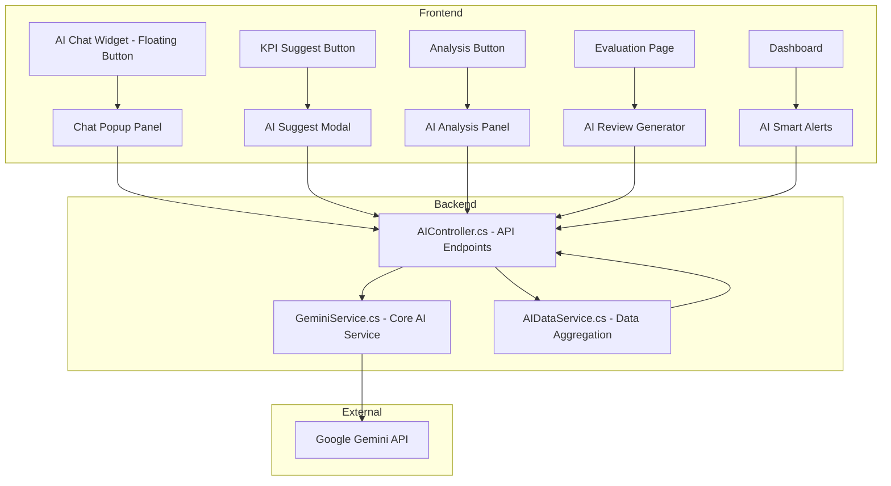

# Tích hợp AI (Google Gemini) vào Hệ thống KPI/OKR

Tích hợp 5 chức năng AI sử dụng **Google Gemini API** (`Google.GenAI` SDK) vào hệ thống quản lý KPI/OKR hiện có (ASP.NET Core MVC, .NET 10).

## User Review Required

> [!IMPORTANT]
> Bạn cần tạo một **Gemini API Key miễn phí** tại [Google AI Studio](https://aistudio.google.com/apikey) và cung cấp key để lưu trong file `.env`. Model sử dụng: **gemini-2.5-flash** (miễn phí, nhanh, đủ mạnh cho use case này).

> [!WARNING]
> Gemini API miễn phí có giới hạn **15 requests/phút** và **1500 requests/ngày**. Hệ thống sẽ implement rate limiting phía client để tránh vượt quota.

---

## Tổng quan kiến trúc

---

## Proposed Changes

### Component 1: NuGet Package & Configuration

#### [MODIFY] [Manage-KPI-or-OKR-System.csproj](file:///c:/Users/Cua/Desktop/Manage-KPI-or-OKR-System/Manage-KPI-or-OKR-System.csproj)
- Thêm package `Google.GenAI` (official Google SDK)

#### [MODIFY] [.env](file:///c:/Users/Cua/Desktop/Manage-KPI-or-OKR-System/.env)
- Thêm biến `GEMINI_API_KEY=your_api_key_here`

---

### Component 2: Backend Services

#### [NEW] Services/GeminiService.cs
Service chính gọi Gemini API, xử lý:
- Gửi prompt và nhận response (text generation)
- System instruction cho từng use case (chatbot, suggest, analysis, evaluation, alert)
- Error handling & rate limiting
- Streaming support cho chat

#### [NEW] Services/AIDataService.cs
Service trung gian thu thập dữ liệu từ DB để build context cho AI:
- **GetEmployeeContext()**: Thông tin nhân viên, phòng ban, chức vụ
- **GetKPIPerformanceData()**: Dữ liệu check-in, tiến độ KPI theo kỳ
- **GetOKRContext()**: Dữ liệu OKR, key results, tiến độ
- **GetDepartmentPerformance()**: Hiệu suất phòng ban
- **GetAtRiskKPIs()**: KPI có nguy cơ không đạt (dùng cho smart alerts)

---

### Component 3: API Controller

#### [NEW] Controllers/AIController.cs
API controller xử lý tất cả request AI:

| Endpoint | Method | Chức năng |
|---|---|---|
| `/AI/Chat` | POST | Chatbot - hỏi đáp về KPI/OKR |
| `/AI/SuggestKPI` | POST | Gợi ý KPI cho nhân viên/phòng ban |
| `/AI/AnalyzePerformance` | POST | Phân tích hiệu suất |
| `/AI/GenerateReview` | POST | Sinh nhận xét đánh giá |
| `/AI/SmartAlerts` | GET | Lấy cảnh báo thông minh |

Tất cả endpoint đều `[Authorize]` và phân quyền theo role.

---

### Component 4: Frontend - AI Chat Widget (Global)

#### [NEW] Views/Shared/_AIChatWidget.cshtml
Partial view cho AI Chatbot Widget:
- **Floating button** (góc phải dưới) với icon AI + animation pulse
- **Chat panel** slide-up với:
  - Header có branding "VietMach AI Assistant"
  - Chat messages area (user + AI bubbles)
  - Suggested quick actions (3-4 nút gợi ý)
  - Input area với send button
- Markdown rendering cho AI responses
- Typing indicator animation
- Responsive design (mobile-friendly)

#### [MODIFY] [_Layout.cshtml](file:///c:/Users/Cua/Desktop/Manage-KPI-or-OKR-System/Views/Shared/_Layout.cshtml)
- Include `_AIChatWidget` partial vào layout (trước `</body>`)

---

### Component 5: Frontend - AI KPI Suggestion

#### [MODIFY] Views/KPIs/Create.cshtml
- Thêm nút **"🤖 AI Gợi ý KPI"** cạnh form tạo KPI
- Khi nhấn → hiện modal, user chọn nhân viên/phòng ban → AI đề xuất 3-5 KPI phù hợp
- User có thể "Áp dụng" gợi ý để tự động fill vào form

---

### Component 6: Frontend - AI Performance Analysis

#### [MODIFY] Views/Dashboard/Index.cshtml
- Thêm card **"🧠 AI Phân tích Hiệu suất"** trên Dashboard
- Nút "Phân tích" → gọi API → hiện kết quả phân tích dưới dạng card nổi bật
- Nội dung: Nhận xét tổng quan, điểm mạnh/yếu, xu hướng, gợi ý cải thiện

---

### Component 7: Frontend - AI Evaluation Review

#### [MODIFY] Views/EvaluationResults/Index.cshtml  
- Thêm nút **"✍️ AI Viết nhận xét"** cho mỗi kết quả đánh giá
- AI tự động sinh nhận xét đánh giá dựa trên: điểm số, tiến độ KPI, lịch sử check-in
- Manager có thể chỉnh sửa trước khi lưu

---

### Component 8: Frontend - AI Smart Alerts

#### [MODIFY] Views/Shared/_Layout.cshtml (notification area)
- Thêm tab **"AI Insights"** trong dropdown thông báo
- Hiển thị cảnh báo thông minh: KPI sắp hết hạn, KPI chậm tiến độ, nhân viên cần hỗ trợ
- Badge riêng cho AI alerts

---

### Component 9: Styling

#### [MODIFY] [site.css](file:///c:/Users/Cua/Desktop/Manage-KPI-or-OKR-System/wwwroot/css/site.css)
Thêm CSS cho toàn bộ UI AI:
- Chat widget floating button + panel
- AI response cards with glassmorphism
- Typing indicator animation
- AI suggestion modals
- Smart alert styling
- Gradient accents cho AI branding (purple/blue gradient - phân biệt với theme chính)

---

### Component 10: Program.cs Registration

#### [MODIFY] [Program.cs](file:///c:/Users/Cua/Desktop/Manage-KPI-or-OKR-System/Program.cs)
- Đăng ký `GeminiService` và `AIDataService` vào DI container

---

## Phân quyền AI theo Role

| Chức năng | Admin | Director | Manager | Employee/Sales |
|---|---|---|---|---|
| AI Chatbot | ✅ Toàn hệ thống | ✅ Toàn công ty | ✅ Phòng ban | ✅ Cá nhân |
| Gợi ý KPI | ✅ | ✅ | ✅ | ❌ |
| Phân tích hiệu suất | ✅ | ✅ | ✅ Phòng ban | ✅ Cá nhân |
| Viết nhận xét | ✅ | ✅ | ✅ | ❌ |
| Cảnh báo thông minh | ✅ | ✅ | ✅ Phòng ban | ✅ Cá nhân |

---

## Open Questions

> [!IMPORTANT]
> **Bạn đã có Gemini API Key chưa?** Nếu chưa, hãy tạo tại [Google AI Studio](https://aistudio.google.com/apikey) — miễn phí, chỉ cần Google account.

---

## Verification Plan

### Automated Tests
1. Build thành công: `dotnet build`
2. Chạy dev server: `dotnet watch run`

### Manual Verification
1. Mở browser → test chatbot widget (hỏi đáp về KPI)
2. Vào trang tạo KPI → test nút "AI Gợi ý KPI"
3. Dashboard → test card phân tích hiệu suất
4. Evaluation Results → test nút viết nhận xét AI
5. Kiểm tra thông báo → tab AI Insights
6. Test với các role khác nhau (Admin, Manager, Employee)
