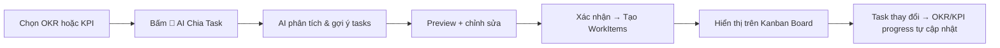

# Tích hợp AI tự động chia nhỏ Task vào Kanban Board nội bộ

## Mô tả

Bạn đã có hệ thống Kanban board nội bộ hoàn chỉnh (WorkProjects + WorkItems), nên **KHÔNG CẦN Trello API key** bên ngoài. Tính năng mới sẽ dùng **Gemini AI** (đã có sẵn) để phân tích OKR/KPI → tự động chia nhỏ thành WorkItems → đẩy thẳng vào Kanban board nội bộ + phân công nhân viên.

**Đồng bộ 2 chiều** đã có sẵn trong hệ thống (`SyncTaskGoalProgressAsync`): khi task trên Kanban thay đổi trạng thái → OKR/KPI progress tự động cập nhật.

### Luồng hoạt động


```mermaid
flowchart LR
    A["Chọn OKR hoặc KPI"] --> B["Bấm 🤖 AI Chia Task"]
    B --> C["AI phân tích & gợi ý tasks"]
    C --> D["Preview + chỉnh sửa"]
    D --> E["Xác nhận → Tạo WorkItems"]
    E --> F["Hiển thị trên Kanban Board"]
    F --> G["Task thay đổi → OKR/KPI progress tự cập nhật"]
```

---

## Proposed Changes

### Component 1: AI Task Decomposition Service

Service dùng Gemini AI phân tích OKR/KPI, kết hợp context nhân sự phòng ban, trả về danh sách task gợi ý.

#### [NEW] [AITaskDecompositionService.cs](file:///e:/Dự%20Án%20Tốt%20Nghiệp/Manage-KPI-or-OKR-System/Services/AITaskDecompositionService.cs)

- **Interface `IAITaskDecompositionService`** với 2 method:
  - `DecomposeOKRAsync(int okrId)` — phân tích OKR Objective + Key Results
  - `DecomposeKPIAsync(int kpiId)` — phân tích KPI + chi tiết target

- **Logic chính:**
  1. Query DB lấy OKR (Objective, Key Results, Cycle) hoặc KPI (Name, Target, Threshold)
  2. Query danh sách nhân viên + phòng ban liên quan (từ `OKR_Department_Allocation` / `KPI_Department_Assignment`)
  3. Xây dựng prompt gửi Gemini AI:
     - Cung cấp context đầy đủ: mục tiêu, key results, nhân sự, phòng ban
     - Yêu cầu trả về JSON array với: `title`, `description`, `priority`, `assigneeId`, `departmentId`, `kanbanStatus`, `estimatedDays`, `kpiImpactWeight`
  4. Parse JSON response, validate, map `assigneeId`/`departmentId` với dữ liệu thực trong DB
  5. Trả về `List<DecomposedTaskDto>`

---

### Component 2: Request/Response Models

#### [NEW] [TrelloAIViewModels.cs](file:///e:/Dự%20Án%20Tốt%20Nghiệp/Manage-KPI-or-OKR-System/Models/AI/TrelloAIViewModels.cs)

```csharp
// Request để AI phân tích
public class DecomposeOKRRequest 
{
    public int OKRId { get; set; }
    public string? AdditionalContext { get; set; }  // gợi ý thêm từ user
}

public class DecomposeKPIRequest 
{
    public int KPIId { get; set; }
    public string? AdditionalContext { get; set; }
}

// 1 task được AI gợi ý
public class DecomposedTaskDto
{
    public string Title { get; set; }
    public string? Description { get; set; }
    public string Priority { get; set; } = "Normal";   // Low/Normal/High/Urgent
    public int? AssigneeId { get; set; }
    public string? AssigneeName { get; set; }           // hiển thị trên UI preview
    public int? DepartmentId { get; set; }
    public string? DepartmentName { get; set; }
    public string KanbanStatus { get; set; } = "Todo";  // Backlog/Todo/InProgress
    public int EstimatedDays { get; set; } = 7;
    public decimal KpiImpactWeight { get; set; } = 1;
    public int? KPIId { get; set; }
    public int? OKRKeyResultId { get; set; }
}

// Response trả về cho UI preview
public class DecomposeResponse
{
    public bool Success { get; set; } = true;
    public List<DecomposedTaskDto> Tasks { get; set; } = new();
    public string? SourceObjective { get; set; }        // tên OKR/KPI gốc
    public int? SuggestedProjectId { get; set; }        // WorkProject phù hợp (nếu có)
    public string? SuggestedProjectName { get; set; }
    public List<string> Warnings { get; set; } = new();
}

// Request xác nhận tạo task thật
public class ConfirmDecomposeRequest
{
    public int? WorkProjectId { get; set; }             // nếu null → tạo project mới
    public string? NewProjectName { get; set; }         // tên project mới (nếu tạo)
    public int? SourceOKRId { get; set; }
    public int? SourceKPIId { get; set; }
    public List<DecomposedTaskDto> Tasks { get; set; } = new();
}

public class ConfirmDecomposeResponse
{
    public bool Success { get; set; } = true;
    public int WorkProjectId { get; set; }
    public int TasksCreated { get; set; }
    public List<string> Warnings { get; set; } = new();
}
```

---

### Component 3: Controller - API Endpoints

#### [MODIFY] [AIController.cs](file:///e:/Dự%20Án%20Tốt%20Nghiệp/Manage-KPI-or-OKR-System/Controllers/AIController.cs)

Thêm 3 endpoints mới vào AIController (vì đây là tính năng AI):

| Endpoint | Mô tả |
|----------|--------|
| `POST /AI/DecomposeOKR` | AI phân tích OKR → trả về danh sách task gợi ý (preview) |
| `POST /AI/DecomposeKPI` | AI phân tích KPI → trả về danh sách task gợi ý (preview) |
| `POST /AI/ConfirmDecompose` | Xác nhận → tạo WorkProject (nếu cần) + tạo WorkItems thật trong DB |

**Logic `ConfirmDecompose`:**
1. Tạo hoặc lấy WorkProject liên kết với OKR/KPI
2. Loop qua danh sách tasks đã confirm → tạo WorkItem cho mỗi task
3. Gọi `RecalculateProjectProgressAsync` và `SyncTaskGoalProgressAsync` (logic có sẵn)
4. Lưu AI history
5. Redirect/trả URL đến Kanban board

---

### Component 4: Frontend UI - Nút AI trên trang OKR Details

#### [MODIFY] OKRs Details View

Thêm vào trang chi tiết OKR:
- **Nút "🤖 AI Chia nhỏ Task"** — bấm vào gọi `/AI/DecomposeOKR`
- **Modal preview** hiển thị bảng danh sách task AI gợi ý:
  - Mỗi task hiển thị: Title, Description, Priority, Assignee, Department, Deadline
  - Cho phép **chỉnh sửa** từng field trước khi xác nhận
  - Cho phép **xóa** task không muốn
  - Input "Gợi ý thêm" để user bổ sung context cho AI
- **Dropdown chọn WorkProject đích** (hoặc tạo mới)
- **Nút "Xác nhận tạo Task"** → gọi `/AI/ConfirmDecompose` → chuyển hướng đến Kanban board

#### [MODIFY] WorkProjects Details View (Kanban Board)

- Thêm nút **"🤖 AI Gợi ý thêm Task"** vào header Kanban (bên cạnh nút "Thêm công việc mới")
- Hiển thị **badge "AI Generated"** trên các task được tạo tự động bởi AI

---

### Component 5: DI Registration

#### [MODIFY] [Program.cs](file:///e:/Dự%20Án%20Tốt%20Nghiệp/Manage-KPI-or-OKR-System/Program.cs)

```csharp
builder.Services.AddScoped<IAITaskDecompositionService, AITaskDecompositionService>();
```

---

## Đồng bộ 2 chiều (Đã có sẵn!)

Hệ thống của bạn **đã có đồng bộ 2 chiều** thông qua method `SyncTaskGoalProgressAsync()` trong [WorkProjectsController.cs](file:///e:/Dự%20Án%20Tốt%20Nghiệp/Manage-KPI-or-OKR-System/Controllers/WorkProjectsController.cs):

| Chiều | Hoạt động |
|-------|-----------|
| **Task → OKR/KPI** | Khi WorkItem thay đổi trạng thái/progress → tự động cập nhật KPI CheckIn value và OKR KeyResult progress |
| **OKR/KPI → Task** | Khi OKR/KPI được AI decompose → tạo WorkItems liên kết qua `KPIId` và `OKRKeyResultId` |

> [!TIP]
> Không cần thêm Trello webhook hay logic sync phức tạp — tất cả đã được xử lý trong hệ thống hiện tại!

---

## Tổng kết file thay đổi

| File | Hành động | Mô tả |
|------|-----------|-------|
| `Services/AITaskDecompositionService.cs` | **NEW** | Service AI decompose OKR/KPI → tasks |
| `Models/AI/TrelloAIViewModels.cs` | **NEW** | Request/Response models |
| `Controllers/AIController.cs` | **MODIFY** | Thêm 3 endpoints mới |
| `Views/OKRs/Details.cshtml` | **MODIFY** | Nút AI + Modal preview |
| `Views/WorkProjects/Details.cshtml` | **MODIFY** | Nút AI + Badge |
| `Program.cs` | **MODIFY** | Đăng ký DI service |

> [!IMPORTANT]
> **Không cần Trello API key, không cần migration mới, không cần package mới.** Toàn bộ tích hợp dựa trên hạ tầng đã có (Gemini AI + WorkProjects + WorkItems).

---

## Verification Plan

### Automated Tests
```bash
dotnet test tests/ManageKpiOkrSystem.Tests/ --filter "Decompose"
```

### Manual Verification
1. Mở trang chi tiết 1 OKR → bấm "🤖 AI Chia nhỏ Task" → verify AI trả về 3-7 task hợp lý
2. Chỉnh sửa assignee/priority → bấm "Xác nhận" → verify tasks xuất hiện trên Kanban board
3. Kéo thả task sang "Done" → verify OKR progress tự động cập nhật
4. Thử với KPI → verify tương tự
